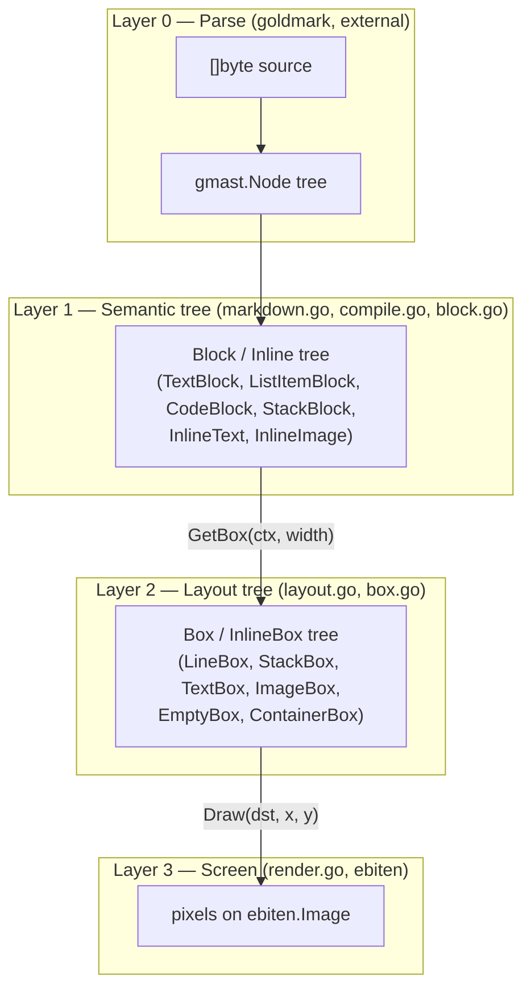

# Architecture

Why Not renders a Markdown document to an `ebiten.Image` in four layers.
Each layer's job is to know less than the one below it: the parser
knows nothing about fonts, the semantic tree knows nothing about pixel
widths, and so on. That separation is the good part of the current
design and is worth keeping. What's missing is *lifecycle* — knowing
which layer to redo when, and when to leave one alone.

## Layer 0 — Parse

`goldmark` turns the raw `[]byte` into a `gmast.Node` tree. This is
off-the-shelf and outside our control; it's the source of truth for
document structure (headings, lists, emphasis nesting, etc.).

## Layer 1 — Semantic tree (`Block` / `Inline`)

`MarkdownCompiler.CompileNode`/`CompileBlock`/`AppendInlineNode`
([compile.go](cmd/whynot/compile.go), config data in
[markdown.go](cmd/whynot/markdown.go)) walk the goldmark tree once and
produce a tree of `Block` and `Inline` values
([block.go](cmd/whynot/block.go)):

- `Block`: `TextBlock`, `ListItemBlock`, `CodeBlock`, `StackBlock` —
  paragraphs, list items, code blocks, and vertical stacks of blocks
  (documents, lists).
- `Inline`: `InlineText`, `InlineImage` — a run of styled text or an
  image.

This is where Markdown semantics get resolved into rendering intent:
emphasis nesting becomes a concrete `TextStyle` (bold/italic/weight),
heading level becomes a concrete font size and `Margins`, list marker
characters get computed. Nothing here knows about pixel widths, fonts
as loaded glyphs, or the screen — a `Block` tree is a description of
*what* to draw, not *how it fits*.

This tree is built exactly once, at startup (`main.go:21`), from the
whole document. It never changes afterwards — there's no editing, so
this is correctly a build-once artifact.

## Layer 2 — Layout tree (`Box` / `InlineBox`)

`Block.GetBox(ctx, width)` / `Inline.GetInlineBox(ctx)`
([layout.go](cmd/whynot/layout.go)) take a concrete pixel `width` and a
`RenderingContext` (DPI scale + font face cache) and produce a `Box` /
`InlineBox` tree ([box.go](cmd/whynot/box.go)): `TextBox`, `ImageBox`,
`LineBox` (one wrapped line), `StackBox` (vertical list with margins
already resolved to gaps), `ContainerBox` (indentation offset),
`EmptyBox` (margin spacer).

This is where line-wrapping happens (`splitBoxes` in
[layout.go:142](cmd/whynot/layout.go#L142)) and where fonts actually
get selected and measured (`font.BoundString` in
[box.go:30](cmd/whynot/box.go#L30)). A `Box` knows its own pixel
`Bounds()` ([box.go](cmd/whynot/box.go)) and can `Draw()` itself at an
`(x, y)` ([render.go](cmd/whynot/render.go)) — it is a fully resolved
layout, not a description.

**This is the layer that should be recomputed only when `width`
changes** (i.e. on window resize) — nothing about it depends on scroll
position or frame number.

## Layer 3 — Screen

`box.Draw(screen, 0, int(offsetY))` in
[main.go:53-56](cmd/whynot/main.go#L53-L56) walks the already-resolved
`Box` tree and issues `ebiten` draw calls, offset by the current
scroll position.

**This is the only layer that should run every frame** — it's "take
what's already laid out and paint the part that's visible."

## File organization vs. the layers

Files are now split by *data vs. transition*, not just by type family,
so each layer boundary has an actual file to live in instead of being
implied by which method you're reading:

| File | What's in it | Layer(s) |
|---|---|---|
| `main.go` | game loop/controller, plus layer-0 invocation (`os.ReadFile` → `parseMarkdown`), plus layer-3 invocation (`GetBox` + `Draw` every frame) | 0 + 3, mixed with app control |
| `markdown.go` | `MarkdownCompiler` / `partStyle` — the style config data the compiler works from | 0/1 config data |
| `compile.go` | `parseMarkdown` + `MarkdownCompiler` methods — the 0→1 transition (goldmark → `Block`/`Inline`) | 0→1 |
| `block.go` | `Block`/`Inline` type defs, `Margins`, and the trivial `Margins()` getters | 1 (data) |
| `layout.go` | `RenderingContext`, `GetBox`/`GetInlineBox`/`GetBounds` methods, `splitBoxes` — the 1→2 transition | 1→2 |
| `box.go` | `Box`/`InlineBox` type defs + their self-describing `Bounds`/`BoundsAndAdvance`/`SpaceWidth` methods | 2 (data) |
| `render.go` | `Draw`/`DrawInline` methods for every box type — the 2→3 transition | 2→3 |
| `textstyle.go` | font face selection/caching | cross-cutting infra used by layer 2, not a layer itself |

This gives the caching fix (issue #1 below) an obvious home: it's
entirely a `layout.go` concern (cache what `GetBox` produces) plus a
one-line change in `main.go` (call it from `Layout()`, not `Draw()`).
Before this split, `GetBox` was just a method on `Block` that
`main.go` happened to call from the wrong place, with nothing in the
file layout signaling that resize-time and frame-time work were
getting conflated — that's fixed now; the *caching itself* isn't done
yet, only the seam to do it in.

---

## Main issues

### 1. No lifecycle — layers 1–3 all run every frame

`Draw()` calls `c.block.GetBox(c.ctx, width)` unconditionally
([main.go:54](cmd/whynot/main.go#L54)), which reruns *all* of Layer 2
— every font lookup, every glyph measurement, every line split — at
60fps, even though `width` only changes on resize and the `Block` tree
never changes at all. This is the single biggest structural gap: the
code has the right layer boundaries but doesn't use them to avoid
redundant work. It "works" today only because the test document is
tiny.

### 2. No viewport culling

`StackBox.Draw` ([render.go:53](cmd/whynot/render.go#L53)) draws every
child regardless of whether it's within the visible scroll window.
Combined with #1, a long document would re-measure *and* re-draw
content the user can't currently see, every frame. Once layout is
cached (fixing #1), culling to the visible `y` range is the natural
next step and is what actually makes scrolling a long document cheap.

### 3. Dead/duplicated layout code

`Block.GetBounds` is a second, hand-duplicated implementation of the
line-splitting logic in `GetBox` (compare
[layout.go:56-69](cmd/whynot/layout.go#L56-L69) with
[layout.go:70-83](cmd/whynot/layout.go#L70-L83)), and
`StackBlock.GetBounds` is just a stub returning `image.Rectangle{}`
([layout.go:116-118](cmd/whynot/layout.go#L116-L118)). Once you have a
`Box`, `Box.Bounds()` already gives you this — `GetBounds` looks like
an earlier approach that was superseded by `GetBox` but never removed.
Now that both live in `layout.go`, the duplication is easy to see
side by side.

### 4. Unhandled edge cases (will panic)

- `StackBlock.Margins()` indexes `b.blocks[0]` /
  `b.blocks[len(b.blocks)-1]` unconditionally
  ([block.go:85-90](cmd/whynot/block.go#L85-L90)) — an empty
  list or empty document crashes.
- Any unrecognized goldmark node kind hits `panic(...)` /
  `log.Panicf(...)` in `CompileBlock` and `AppendInlineNode`
  (e.g. links today) — one unsupported Markdown construct takes down
  the whole app instead of degrading (render as plain text, skip, or
  log-and-continue).

### 5. Duplication across `TextBlock` / `ListItemBlock` / `CodeBlock`

All three repeat the same "turn `Inline`s into `InlineBox`es, then
either `splitBoxes`-loop or one-box-per-line" shape. A shared
`linesFromInline(ctx, parts, width) []Box` helper would remove the
copy-paste and be the single place to fix once instead of three times.

### 6. Silent failures

`ebitenutil.NewImageFromFile` errors are discarded in
`AppendInlineNode` ([compile.go:194](cmd/whynot/compile.go#L194))
— a missing/broken image just renders nothing with no signal why.

---

## The fundamental fix: three explicit lifecycles instead of one

The layer boundaries (`Block` / `Box` / screen) are already right. What's
missing is treating them as three different *update frequencies*
instead of recomputing everything every frame:

| Tier | Recompute when... | Currently |
|---|---|---|
| Parse → `Block` tree | Document changes (never, today) | ✅ done once, correct |
| `Block` → `Box` tree | `width` changes (resize) | ❌ redone every frame |
| `Box` tree → pixels, culled to viewport | Every frame (cheap) | ❌ redraws everything, not just visible |

Concretely: cache the `Box` tree on the controller, keyed on width;
rebuild it in `Layout()` (which already fires on resize) instead of in
`Draw()`; and give `StackBox.Draw` a visible-range so it skips
children entirely above/below the viewport. That one change fixes the
performance issue and sets up culling as a small follow-on, and it's
the change I'd make before adding more Markdown features — features
land on top of this shape either way, so it's cheaper to fix now than
after `CodeBlock`/`TextBlock`/`ListItemBlock` grow more variants.
