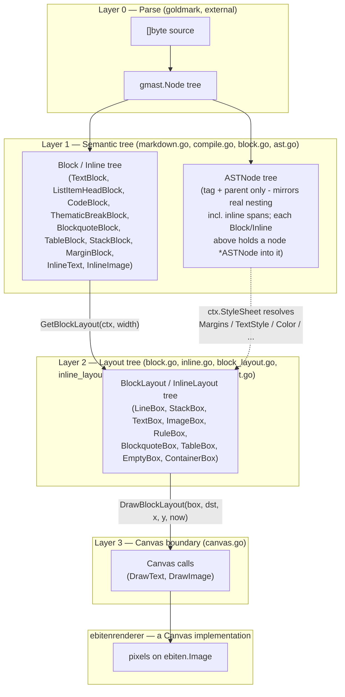

# Architecture

Why Not is a library for rendering a Markdown document onto a `Canvas` -
an interface, not a specific rendering backend - plus `ebitenrenderer`, a
package implementing that interface on top of `ebiten`, and a thin CLI that
demonstrates the two together. The library lives at the repo root (package
`whynot`, `github.com/arnodel/whynot`); `cmd/whynot` is a small
`ebiten.Game` wrapper around it, and `cmd/test` is an unrelated scratch
program.

## Package layout

| Path | What it is |
|---|---|
| repo root | the library (package `whynot`) - parsing, layout, and the `Canvas` interface; no rendering backend dependency |
| `ebitenrenderer/` | implements `whynot.Canvas` on top of `ebiten`, and `Panel` for embedding a `View` in part of a larger game window |
| `cmd/whynot/` | the one real tool: a standalone viewer, window setup + input plumbing only, all rendering behavior lives in the library |
| `cmd/test/` | unrelated scratch program, not part of this project |
| `examples/panel/` | runnable example of `ebitenrenderer.Panel` embedded alongside other game content (`go run ./examples/panel`) |
| `examples/view/` | runnable example of `whynot.View` wired up by hand (`go run ./examples/view`) |
| `testdata/` | fixture Markdown/images used by the library's own tests (`go test` ignores this directory as a package) |

## The four-layer rendering pipeline

Rendering happens in four layers. Each layer's job is to know less than the
one below it: the parser knows nothing about fonts, the semantic tree knows
nothing about pixel widths, and so on.

`stylesheet.go` and `textstyle.go` cut across layers 1 and 2. Layer 1's
`ASTNode` tree ([ast.go](ast.go)) records only structure - each node's
semantic tag (`TagParagraph`, `TagHeading1`..`6`, `TagEmphasis`, `TagLink`,
...) and its parent - no appearance. Layer 2 resolves that tag ancestry
against a `StyleSheet` ([stylesheet.go](stylesheet.go)) - `Margins`,
`TextStyle` (via `RenderingContext.ResolvedTextStyle`, merging
contributions across ancestry so e.g. `Strong` nested inside `Emphasis`
picks up both), `Color`/`BorderColor`, `StrikeThickness`, table/blockquote
geometry - during `GetBlockLayout`/`GetInlineLayout`, so the same parsed document can
render under a different `StyleSheet` without re-parsing. `TextStyle`
(the struct, in [textstyle.go](textstyle.go)) is what `StyleSheet`
resolves *to* and what `FaceSelector` resolves *from* - the vocabulary
connecting the two, not something a `Block` carries itself.

### Layer 0 — Parse

`goldmark` turns the raw `[]byte` into a `gmast.Node` tree. Off-the-shelf,
outside our control; it's the source of truth for document structure.

### Layer 1 — Semantic tree (`Block` / `Inline` + `ASTNode`)

`MarkdownCompiler.CompileNode`/`CompileBlock`/`AppendInlineNode`
([compile.go](compile.go); `MarkdownCompiler` itself, in
[markdown.go](markdown.go), holds nothing but the source bytes) walk the
goldmark tree once and produce two parallel trees: a `Block`/`Inline` tree
([block.go](block.go)) - `TextBlock`, `ListItemHeadBlock`, `CodeBlock`,
`ThematicBreakBlock`, `BlockquoteBlock`, `TableBlock`, `StackBlock` for
blocks; `InlineText`, `InlineImage` for inline content - and an `ASTNode`
tree ([ast.go](ast.go)) giving each one a semantic tag (`TagParagraph`,
`TagHeading1`..`6`, `TagEmphasis`, `TagStrong`, `TagLink`, ...) and a
parent, mirroring real document nesting *including* inline spans, which
the `Block`/`Inline` tree itself keeps flat (line-wrapping needs a linear
sequence; `ASTNode.Parent` is where the nesting actually lives). This is
where Markdown syntax gets resolved into semantic *structure* - which tag,
what nests in what - not into appearance: no font, color, or margin value
is decided here, only recorded via each `Block`/`Inline`'s `node *ASTNode`
field for `StyleSheet` to resolve later, in Layer 2.

Margins aren't a field every `Block` carries: most embed `WithoutMargins`
(a zero-value `Margins()`) and get real ones only where the compiler wraps
them in a `MarginBlock{Block, node}` - resolved from `StyleSheet.Margins`
against that node during `GetBlockLayout`, not baked in here at construction time.
`StackBlock` is the one exception with real, non-trivial margins of its
own - its Top/Bottom is whatever its first/last child reports, the same
adjacent-margin collapsing `GetBlockLayout` applies between siblings, extended to
its own edges - so a `MarginBlock` wrapping a `StackBlock` collapses
correctly with the outermost child instead of stacking on top of it.

Built once per document, by `Parse` ([compile.go](compile.go)), and never
rebuilt — `Block`s are immutable for the life of the program.

### Layer 2 — Layout tree (`BlockLayout` / `InlineLayout`)

`Block.GetBlockLayout(ctx, width)` ([block.go](block.go)) / `Inline.GetInlineLayout(ctx)`
([inline.go](inline.go)) take a concrete pixel `width` and a
`RenderingContext` ([rendering_context.go](rendering_context.go); DPI scale,
font face cache, and `StyleSheet`) and produce a `BlockLayout` /
`InlineLayout` tree ([block_layout.go](block_layout.go),
[inline_layout.go](inline_layout.go)): `TextBox`,
`ImageBox`, `LineBox` (one wrapped line), `StackBox` (vertical stack with
margins resolved to gaps), `ContainerBox` (indentation), `EmptyBox`
(margin spacer). This is where appearance actually gets resolved -
`ctx.StyleSheet.Margins`/`.Color`/`.BorderColor`, `ctx.ResolvedTextStyle`/
`.ResolvedColor` (ancestry-merged `TextStyle`/color), `ctx.Scaled*` (the
dimensional constants, scaled by DPI in one step) - all read against each
`Block`/`Inline`'s own `*ASTNode`. Line-wrapping happens here
(`splitBoxes`), as does font selection (`ctx.SelectFace`, given the
resolved `TextStyle`) and glyph measurement (`font.BoundString`).

Rebuilt only when `width` or DPI scale change (see `View.Layout` below) —
unlike `Block`, a `BlockLayout` tree is fully replaced on every rebuild rather than
mutated, which is what makes the memoization described next safe.

### Layer 3 — the `Canvas` boundary

`Canvas` ([canvas.go](canvas.go)) is the sole interface between
backend-agnostic layout and actual drawing: `Bounds`, `DrawText`,
`DrawImage`. `DrawImage` takes an already-decoded `image.Image`, not a
source path — resolving, fetching, and decoding an image is entirely
the library's own concern (`ImageCache`, see "Image loading" below), so
a `Canvas` implementation never fetches or decodes anything itself; its
job is purely backend-specific conversion (e.g. uploading a texture),
which it's free to cache keyed by the `image.Image`'s own identity,
since the same resolved image comes back from `ImageCache` every time.

`DrawBlockLayout(box, dst, x, y, now)` ([block_layout.go](block_layout.go)) is the *only* way a
`BlockLayout` gets drawn — it checks `box.Bounds()` against `dst.Bounds()` and
skips `drawContents` (the type-specific drawing logic) entirely if they
don't overlap. Every `BlockLayout` implementation gets that off-screen skip for
free this way, including `ContainerBox` delegating to its inner box,
rather than each type having to remember to check. `StackBox.drawContents`
also breaks out of its child loop once a child starts past the viewport's
bottom edge — safe because children are laid out top-to-bottom with no
overlap, so nothing further down can be visible either.

`ebitenrenderer.Renderer`/`Canvas` is the one implementation today. A
`Renderer` owns caches (each decoded `image.Image`'s uploaded
`ebiten.Image`, keyed by the `image.Image`'s own identity; per-`font.Face`
glyph caches from `text/v2`) that should persist across frames;
`NewCanvas(dst)` returns a cheap per-frame `Canvas` sharing those caches,
so multiple `View`s drawn through one `Renderer` share GPU uploads and
glyph caches instead of duplicating them.

## `View`: tying the layers together with the right lifecycle

[view.go](view.go)'s `View` is what a caller actually uses. It owns:

- the `Block` tree (built once, in `NewView`)
- the current `BlockLayout` tree, **cached** and only rebuilt in `Layout` when
  `width` or `scale` actually change — not on every `Draw` call
- the scroll position, as a `stackCursor{index, offset}` ([block_layout.go](block_layout.go)):
  which top-level entry is at the top of the viewport, and how far
  (in pixels) into it — and viewport culling via `DrawFrom` in `Draw`
- **resize anchoring**: when `Layout` rebuilds the tree at a new width,
  reflow changes every block's height, so the old pixel scroll offset
  would point at different content. `Layout` converts the cursor to a
  ratio through its slot's old height, then re-derives a cursor at the
  same ratio through that slot's new height, so the same content stays at
  the top across a resize.

Both the `BlockLayout` tree and drawing are **lazy**, anchored at the scroll
cursor rather than the top of the document:

- `StackBlock.GetBlockLayout` builds only a skeleton of `stackSlot`s (margins
  resolved to gap sizes — proportional to block *count*, not content).
  Each slot's own `Block.GetBlockLayout` — the expensive part, including text
  measurement — only runs when `StackBox.boxAt(i)` is asked for that slot,
  and the result is memoized.
- `StackBox.normalizeCursor(cursor)` adjusts a cursor so its offset falls within
  its slot's height, walking to neighboring slots only as far as needed —
  not scanning from the start — so it costs the same whether the cursor is
  near the top of the document or deep inside it. `moveCursor(cursor, dy)`
  builds on it for the common case of shifting an existing cursor (what
  `Scroll` does); a resize re-anchor calls `normalizeCursor` directly, since it
  recomputes a cursor from a ratio rather than shifting one.
- `StackBox.DrawFrom(dst, cursor, x, y)` draws starting at the cursor: it
  never calls `Bounds()` on the whole tree the way `DrawBlockLayout` does, and
  never touches slots before the cursor.

Together, a resize or a frame of drawing only ever pays for slots at or
near the current scroll position, regardless of how large the rest of the
document is.

A caller doesn't read input itself through `View` — `Scroll(dy)` takes a
delta from whatever input source the embedding game uses (negative `dy`
moves forward through the document, matching `ebiten.Wheel()` passed
straight through), and `Layout(width, scale, now)` should be called
every frame regardless of whether width/scale actually changed (`now`,
elapsed time since the embedder started rendering, needs to keep
advancing for animated images even when nothing else did — see "Image
loading" below; the layout tree itself still only rebuilds when width
or scale change). `cmd/whynot`'s `layout.go` (`relayout`) is the minimal
example of wiring this up by hand; `ebitenrenderer.Panel`
([panel.go](ebitenrenderer/panel.go)) packages the same wiring (plus
hover/click/wheel/scrollbar-drag input handling, all gated on its own
bounds) into a reusable type for embedding a `View` into part of a
larger `ebiten.Game`'s window - deliberately ebiten-only, unlike `View`
itself, since a game embedding it is never going to swap engines out
from under it.

`DocumentBounds`/`VisibleViewBounds` expose scroll-position geometry (a caller
scales the ratio between them to whatever real pixel track it's drawing a
scrollbar into) built from the same laziness: each top-level slot's real
pixel height once resolved, extrapolated from the average of what's known for
any slot that isn't, refined as more of the document is visited — never a
full-document layout pass just to answer "how tall is this, roughly."
`ScrollToRatio` is the inverse (e.g. for a scrollbar thumb drag): it
re-derives the target from the *current* estimate on every call rather than
a value captured once, so jumping into not-yet-resolved territory only ever
corrects toward wherever the caller's asking for next — a caller re-deriving
its target from the live input position every frame can't drift, because
nothing carries over between frames for it to drift from.

## Image loading

An image's `src` never blocks layout or drawing. `ImageCache`
([image_loader.go](image_loader.go)) wraps an embedder-supplied
`ImageSource` (resolve + fetch bytes; `FileImageSource` by default,
`cmd/whynot`'s `docImageSource` resolves relative to the document's own
location and fetches over `http(s)` too) and does the actual resolving,
fetching, and decoding on a background goroutine — `Load` always
returns immediately with whatever's currently known (`ImagePending`,
`ImageReady`, or `ImageFailed`), never waiting on I/O itself. A cache
entry's dimensions are often known before the rest of the fetch/decode
completes (`fetchAndDecode` peeks the header via `image.DecodeConfig`
through a `TeeReader`), so `InlineImage.GetInlineLayout` ([inline.go](inline.go))
can lay out an `ImageBox` at its final, correctly-scaled size even
while still `ImagePending` — `ImageBox.DrawInline` draws a placeholder
rect instead of pixels until the real image lands, so nothing reflows
once it does. Pending with no known bounds yet, or `ImageFailed`, falls
back to text instead (alt text, then title, then a generic message),
reusing `InlineText`'s own `GetInlineLayout`.

Since the `BlockLayout`/`InlineLayout` tree is otherwise immutable once
built (see Layer 2 above), a `TextBox`/`ImageBox` standing in for a
still-unsettled image records which resolved `src` it's waiting on
(`PendingImages() []string`, aggregated bottom-up by every composite
type). `View.Layout` ([view.go](view.go)) calls
`ImageCache.ChangedSince` each time it's invoked, and
`invalidateChangedImages` uses `PendingImages()` to discard only the
memoized boxes actually waiting on something that changed — a resolved
slot unrelated to the change, or a slot nobody has scrolled near yet,
is left untouched. The one exception is a change that reveals an
image's bounds for the first time: since that's the one transition
that can change a slot's height unpredictably (every other transition
happens at an already-known, already-laid-out size), it's handled
surgically rather than through a full rebuild — only that one slot is
invalidated (`invalidateSlot`), and only if the scroll cursor is
anchored inside it does its offset get re-derived by ratio through the
new height (`reanchorCursor`). A changed slot *before* the cursor -
already scrolled past - is invalidated the same way but re-resolved
immediately, right there, rather than left lazy: nothing ever walks
backward over an earlier slot again on its own, so a lazily-invalidated
one would silently freeze `DocumentBounds`' estimate at a stale value
forever.

`View.Layout` also does two kinds of prefetching every call, both
scoped to a margin around the current scroll cursor rather than the
whole document (`preLayoutNearby`/`prefetchImageSources`, `view.go`) -
this exists because an image resolving to a much bigger real size than
the small placeholder that was estimating it, right as the scroll
cursor reaches it, is exactly the scenario that can make a
`DocumentBounds`-based scrollbar visibly jump backward even though the
user only ever scrolled forward (the ratio's denominator grows more
than its numerator does in the same frame - see `ebitenrenderer.Panel`'s
`scrollbarThumbRect`, the one thing actually building a scrollbar from
these numbers today). Getting a slot's real size known *before* the
cursor arrives, not right as it does, avoids the surprise instead of
smoothing over it after the fact:

- `preLayoutNearby` fully resolves slots (`StackBox.boxAt`) within a
  few thousand pixels of the visible viewport, in both directions,
  time-budgeted (a couple of milliseconds per `Layout` call) rather
  than all at once - a big jump (`ScrollToRatio`, `ScrollToAnchor`, a
  resize) can leave a lot of newly-close ground, so catching up is
  spread over however many frames it takes.
- `prefetchImageSources` reaches much further (tens of thousands of
  pixels), since it never lays anything out - it only inspects each
  slot's already-parsed `Block` (no `GetBlockLayout` call) for one
  that's *just* a standalone image (`soleImageSrc`) and kicks off
  `ImageCache.Load` early, giving a slow network fetch a head start
  cheaply, deliberately not sharing `preLayoutNearby`'s smaller,
  CPU-time-budgeted radius.

Neither guarantees the jump is impossible - a pathologically slow fetch
could still occasionally lose the race against a very fast scroll - but
both make it rare without abandoning lazy layout for large documents:
`boxAt` already memoizes, so resolving the same nearby window again
next frame is a cheap no-op, and the only real work is for genuinely
new ground - the same total work ordinary scrolling would have paid
reactively anyway, just shifted earlier.

An animated GIF decodes to an `AnimatedImage` ([animated_image.go](animated_image.go))
instead of a plain `image.Image` — `ImageResult`/`ImageBox` carry
exactly one of the two. `decodeAnimatedGIF` composites every frame to a
full-canvas `image.Image` up front, honoring each frame's disposal
method (many real-world GIFs only encode each frame's changed region).
Picking the current frame never affects bounds (every frame shares one
size), so it's handled entirely on the *draw* side: `RenderingContext.Time`
(elapsed time since the embedder started rendering, set every
`View.Layout` call) is threaded as a `now time.Duration` parameter
through `drawContents`/`DrawInline`, and `AnimatedImage.CurrentFrame(now)`
is a pure function of it — no direct `time.Now()` call in library code,
and no per-animation "start" to track, since `now % total` alone
determines the loop position.

## Hit-testing: `View.HitTest`

`View.HitTest(x, y)` ([view.go](view.go)) answers "what's at this
position" in the same coordinate space `Draw`'s own `(x, y)` places
content's origin into - the query counterpart to `Draw`, resolving a
point instead of painting one. Like `Draw`, it's cursor-relative
([block_layout.go](block_layout.go)'s `normalizeCursor`), so a query far from the current
scroll position doesn't force-build every slot in between.

It's built on two small interfaces alongside `BlockLayout`/`InlineLayout`:

- `Source` ([block.go](block.go)) is `Node() *ASTNode` - the common
  ground between `Block` and `Inline`, letting a resolved position trace
  back to its origin in the semantic tree (Layer 1). Every `Block`/
  `Inline` implements it, including `StackBlock`, which reports `nil`
  since it aggregates unrelated children with no identity of its own.
- `Hit` ([block_layout.go](block_layout.go)) is `Bounds() image.Rectangle` + `Source()
  Source` - what `HitTest` returns. Every `BlockLayout`/`InlineLayout`
  satisfies it directly (no separate wrapper type), so a caller gets the
  actual matched box back - useful for type-asserting to its concrete
  type for anything beyond the node itself (e.g. a `*TextBox`'s resolved
  `Color`/`Face`). Composites without a single identity of their own (a
  `LineBox` mixing differently-styled inline spans, an aggregate
  `StackBox`) report a `nil` `Source`, the same as `StackBlock.Node()`.

`BlockLayout.HitTest(p) (Hit, image.Point)` and `InlineLayout.HitTest(p,
x, y) (Hit, image.Point, nextX int)` mirror `drawContents`/`DrawInline`'s
own walk exactly - same recursion shape, same accumulated `(x, y)` for
inline flow - so the query path can't silently drift from the draw path.
`offset` is where the returned `Hit`'s own `Bounds()` should be placed to
land in the caller's coordinate space (`hit.Bounds().Add(offset)`),
rather than a pre-shifted rectangle computed once and threaded through
every recursion level.

`StackBox` falls back to itself - reporting its own `Source` - when the
slot a point falls into doesn't cover it (past the end of a short last
line) or that slot's own `HitTest` declines, the same way
`BlockquoteBox`/`TableBox` already fall back to their own `Source` on a
declining child. This only fires when the `StackBox` was built from a
single owning `Block` (a paragraph's or code block's own wrapped lines,
tracked via an optional `source Block` field set at those
`GetBlockLayout` call sites) - never for an aggregate `StackBox` like
`StackBlock`'s own or the top-level document, which has nothing to fall
back to.

One known imprecision: `View.HitTest` checks a top-level slot's own
`Bounds()` before ever calling its `HitTest`, and a `BlockLayout`'s
`Bounds()` is only as wide as its longest line - not the full page
width. So the fallback above only reaches as far right as some line in
that block actually extends; a single short line (e.g. a heading with no
longer sibling line) has nothing to widen it. Not worth resolving given
callers only query points already within their own rendered viewport.

`cmd/whynot` can outline whatever's under the mouse each frame, via
`HitTest`, gated behind the `-debug-hit` flag (off by default) - see
`game.Draw` in [cmd/whynot/draw.go](cmd/whynot/draw.go).

## Graceful degradation for unsupported Markdown

`CompileBlock`/`AppendInlineNode` ([compile.go](compile.go)) don't
`panic` on a goldmark node kind they have no case for - see
`compileUnsupportedBlock`/`appendUnsupportedInline`. Instead they log a
warning and render the construct as text/a code block tagged
`TagUnsupported`, styled via `StyleSheet.UnsupportedColor` (a "scary"
red, reusing `CodeBlockMargins`/`CodeBlockTextStyle` rather than a new
layout primitive) - showing the construct's own raw source where
goldmark exposes it (`*ast.HTMLBlock`/`*ast.RawHTML`), a placeholder
naming the node kind otherwise.

Two constructs are recognized as *invisible* rather than unsupported,
compiling to no `Block`/`Inline` at all - not a fallback, but the
actually-correct behavior, since no Markdown renderer ever shows them:

- `gmast.KindLinkReferenceDefinition` - the `[ref]: url "title"` line
  itself. The link(s) it defines already resolved correctly before
  compilation ever sees them (goldmark's own reference-resolution
  pass), so this node is pure leftover bookkeeping.
- An HTML comment (`<!-- ... -->`) - `ast.HTMLBlockKind2` for the
  block form; inline `*ast.RawHTML` carries no such kind of its own, so
  the inline case is detected via its raw text's `<!--` prefix instead.

Since a compiled child can now legitimately be `nil` (the two cases
above), every call site that builds a `[]Block` from a sequence of
children (`CompileDocument`, a blockquote's children,
`CompileListItem`'s trailing blocks) filters `nil` out rather than
assuming every child produces a real `Block`.

`cmd/whynot` additionally rejects an `http(s)` fetch whose
`Content-Type` isn't Markdown/plain-text-ish before handing it to
`Parse` - otherwise following a link to a real webpage would feed its
HTML straight into the Markdown parser, which has no way to tell HTML
apart from Markdown itself (everything on the page would become
`TagUnsupported` text). A heuristic, not a guarantee: some servers omit
or misreport `Content-Type` for a perfectly good Markdown file.

## Known issues

These are real, understood, and not yet fixed:

- **Duplication across `TextBlock`/`ListItemHeadBlock`/`CodeBlock`.** All three
  repeat the same "turn `Inline`s into `InlineLayout`s, then `splitBoxes`-loop
  or one-box-per-line" shape in [block.go](block.go). A shared
  `linesFromInline(ctx, parts, width) []BlockLayout` helper would remove the
  copy-paste.
- **A scrollbar built from `DocumentBounds`/`VisibleViewBounds` can still
  jump, including while sitting still.** `preLayoutNearby` (see "Image
  loading" above) resolves real slots beyond the visible viewport in the
  background, on every `Layout` call, regardless of whether the user is
  scrolling - and `DocumentBounds`' total, so a scrollbar's own size and
  position, is a raw, unsmoothed function of whatever's currently
  resolved. So a slot well off-screen settling to a real height different
  from the average estimating it can visibly shift the thumb even with
  zero user input, not just right as the cursor reaches it. Making the
  estimate converge to the truth faster made it visibly less stable
  meanwhile - nothing here smooths what a caller reads. Needs a real
  design (a second notion of "resolved for speed" vs. "resolved for the
  estimate," roughly), not a quick patch - not yet resolved.

## What's next

- **Extend laziness into nested large structures.** Today only the
  top-level `View`-driven `StackBox` is anchored and drawn lazily via
  `boxAt`/`normalizeCursor`/`DrawFrom`. A single huge nested structure — e.g. one
  very long list — still builds and draws its children eagerly once its
  parent slot is resolved, since only `StackBlock.GetBlockLayout`'s top-level
  skeleton is lazy. The same anchoring approach could apply recursively.
