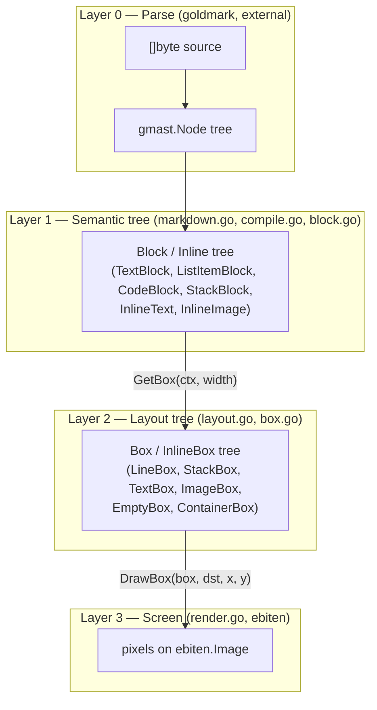

# Architecture

Why Not is a library for rendering a Markdown document into an
`ebiten.Image`, plus a thin CLI that demonstrates it. The library lives at
the repo root (package `whynot`, `github.com/arnodel/whynot`); `cmd/whynot`
is a small `ebiten.Game` wrapper around it, and `cmd/test` is an unrelated
scratch program.

## Package layout

| Path | What it is |
|---|---|
| repo root | the library (package `whynot`) |
| `cmd/whynot/` | CLI demo: window setup + input plumbing only, all rendering behavior lives in the library |
| `cmd/test/` | unrelated scratch program, not part of this project |
| `testdata/` | fixture Markdown/images used by the library's own tests (`go test` ignores this directory as a package) |

## The four-layer rendering pipeline

Rendering happens in four layers. Each layer's job is to know less than the
one below it: the parser knows nothing about fonts, the semantic tree knows
nothing about pixel widths, and so on.

### Layer 0 — Parse

`goldmark` turns the raw `[]byte` into a `gmast.Node` tree. Off-the-shelf,
outside our control; it's the source of truth for document structure.

### Layer 1 — Semantic tree (`Block` / `Inline`)

`MarkdownCompiler.CompileNode`/`CompileBlock`/`AppendInlineNode`
([compile.go](compile.go), config data in [markdown.go](markdown.go)) walk
the goldmark tree once and produce a tree of `Block` and `Inline` values
([block.go](block.go)): `TextBlock`, `ListItemBlock`, `CodeBlock`,
`StackBlock` for blocks; `InlineText`, `InlineImage` for inline content.
This is where Markdown semantics get resolved into rendering intent
(emphasis → `TextStyle`, heading level → font size + `Margins`, etc.) — a
`Block` tree describes *what* to draw, not *how it fits*.

Built once per document, by `Parse` ([compile.go](compile.go)), and never
rebuilt — `Block`s are immutable for the life of the program.

### Layer 2 — Layout tree (`Box` / `InlineBox`)

`Block.GetBox(ctx, width)` / `Inline.GetInlineBox(ctx)`
([layout.go](layout.go)) take a concrete pixel `width` and a
`RenderingContext` (DPI scale + font face cache) and produce a `Box` /
`InlineBox` tree ([box.go](box.go)): `TextBox`, `ImageBox`, `LineBox` (one
wrapped line), `StackBox` (vertical stack with margins resolved to gaps),
`ContainerBox` (indentation), `EmptyBox` (margin spacer). Line-wrapping
happens here (`splitBoxes`), as does font selection and glyph measurement
(`font.BoundString`).

Rebuilt only when `width` or DPI scale change (see `View.Layout` below) —
unlike `Block`, a `Box` tree is fully replaced on every rebuild rather than
mutated, which is what makes the memoization described next safe.

### Layer 3 — Screen

`DrawBox(box, dst, x, y)` ([render.go](render.go)) is the *only* way a
`Box` gets drawn — it checks `box.Bounds()` against `dst.Bounds()` and
skips `drawContents` (the type-specific drawing logic) entirely if they
don't overlap. Every `Box` implementation gets that off-screen skip for
free this way, including `ContainerBox` delegating to its inner box,
rather than each type having to remember to check. `StackBox.drawContents`
also breaks out of its child loop once a child starts past the viewport's
bottom edge — safe because children are laid out top-to-bottom with no
overlap, so nothing further down can be visible either.

## `View`: tying the layers together with the right lifecycle

[view.go](view.go)'s `View` is what a caller actually uses. It owns:

- the `Block` tree (built once, in `NewView`)
- the current `Box` tree, **cached** and only rebuilt in `Layout` when
  `width` or `scale` actually change — not on every `Draw` call
- the scroll offset, and viewport culling via `DrawBox` in `Draw`
- **resize anchoring**: when `Layout` rebuilds the tree at a new width,
  reflow changes every block's height, so the old pixel scroll offset
  would point at different content. `StackBox.anchorAt`/`positionOf`
  ([box.go](box.go)) find which top-level entry is at the top of the
  viewport and how far through it (as an index + ratio, not a raw pixel
  count), and `Layout` re-derives the offset from the same anchor against
  the rebuilt tree, so the same content stays at the top across a resize.

A caller doesn't read input itself through `View` — `Scroll(dy)` takes a
delta from whatever input source the embedding game uses, and `Layout`
should be called whenever available width or display scale change
(typically from the embedding `ebiten.Game`'s own `Layout`). `cmd/whynot`'s
`main.go` is the minimal example of wiring this up.

## Known issues

These are real, understood, and not yet fixed:

- **Unhandled edge cases (will panic).** `StackBlock.Margins()`
  ([block.go:85](block.go#L85)) indexes `b.blocks[0]`/`b.blocks[len-1]`
  unconditionally — an empty list or document crashes. Any unrecognized
  goldmark node kind hits `panic(...)`/`log.Panicf(...)` in `CompileBlock`
  and `AppendInlineNode` ([compile.go](compile.go)) — e.g. links today —
  taking down the whole program instead of degrading gracefully.
- **Duplication across `TextBlock`/`ListItemBlock`/`CodeBlock`.** All three
  repeat the same "turn `Inline`s into `InlineBox`es, then `splitBoxes`-loop
  or one-box-per-line" shape in [layout.go](layout.go). A shared
  `linesFromInline(ctx, parts, width) []Box` helper would remove the
  copy-paste.
- **Silent image failures.** `ebitenutil.NewImageFromFile` errors are
  discarded in `AppendInlineNode` ([compile.go:195](compile.go#L195)) — a
  missing/broken image just renders nothing with no signal why.
- **`Block.GetBounds` is dead, duplicated code** — a second implementation
  of `GetBox`'s line-splitting logic that nothing calls; `Box.Bounds()`
  already gives you this once a `Box` exists.

## What's next: bounding layout cost by viewport, not document size

`GetBox` is not lazy: `StackBlock.GetBox` unconditionally lays out (and,
for text blocks, fully measures via `splitBoxes`) *every* block in the
document, regardless of scroll position. On a ~1000-line test document this
costs **~45ms** (`BenchmarkGetBoxLarge`), paid in full on every resize even
if only the last few lines are visible. This is a different, larger cost
than the one culling already solves — culling bounds *drawing* to the
viewport; this would bound *layout construction* to it too.

The planned approach: make the `(index, ratio)` anchor `View` already
computes for resize the *primary* representation of scroll position (not
just a transient resize-time computation), and make layout construction
incremental — start at the anchor block and build forward only as far as
needed to fill the viewport, using the same "stop once past the viewport"
logic `StackBox.drawContents` already has. Live scrolling should update the
anchor as `(index, pixel offset within that box)`, not `(index, ratio)` —
a wheel delta is naturally a pixel quantity, and ratio only earns its
keep at the point where box height itself changes (i.e. specifically at
resize). This is a bigger change than anything implemented so far: it
turns `GetBox` from "eagerly transform the whole tree" into "produce boxes
on demand," not an additive fix on top of the current contract.
