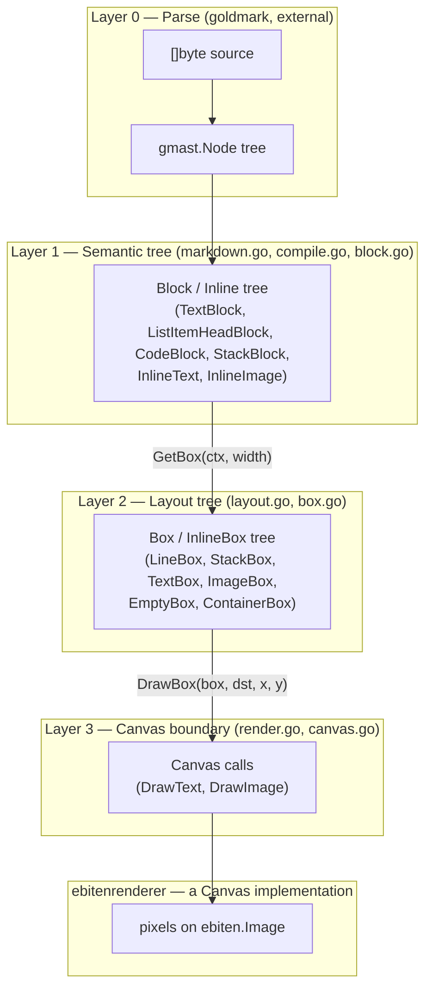

# Architecture

Why Not is a library for rendering a Markdown document onto a `Canvas` -
an interface, not a specific rendering backend - plus `ebitenrenderer`, a
package implementing that interface on top of `ebiten`, and a thin CLI that
demonstrates the two together. The library lives at the repo root (package
`whynot`, `github.com/arnodel/whynot`); `cmd/whynot` is a small
`ebiten.Game` wrapper around it, and `cmd/test` is an unrelated scratch
program.

## Package layout

| Path | What it is |
|---|---|
| repo root | the library (package `whynot`) - parsing, layout, and the `Canvas` interface; no rendering backend dependency |
| `ebitenrenderer/` | implements `whynot.Canvas` on top of `ebiten`; the only place outside `cmd/whynot` that imports `ebiten` |
| `cmd/whynot/` | CLI demo: window setup + input plumbing only, all rendering behavior lives in the library |
| `cmd/test/` | unrelated scratch program, not part of this project |
| `testdata/` | fixture Markdown/images used by the library's own tests (`go test` ignores this directory as a package) |

## The four-layer rendering pipeline

Rendering happens in four layers. Each layer's job is to know less than the
one below it: the parser knows nothing about fonts, the semantic tree knows
nothing about pixel widths, and so on.

`textstyle.go` cuts across layers 1 and 2: `TextStyle`/`FontFamily` are part
of the semantic tree's vocabulary (a `Block` says *which* style it wants),
while `FaceSelector`/`RenderingContext` resolve a style to a concrete
`font.Face` during layout, where DPI and pixel sizes are known.

### Layer 0 — Parse

`goldmark` turns the raw `[]byte` into a `gmast.Node` tree. Off-the-shelf,
outside our control; it's the source of truth for document structure.

### Layer 1 — Semantic tree (`Block` / `Inline`)

`MarkdownCompiler.CompileNode`/`CompileBlock`/`AppendInlineNode`
([compile.go](compile.go), config data in [markdown.go](markdown.go)) walk
the goldmark tree once and produce a tree of `Block` and `Inline` values
([block.go](block.go)): `TextBlock`, `ListItemHeadBlock`, `CodeBlock`,
`StackBlock` for blocks; `InlineText`, `InlineImage` for inline content.
This is where Markdown semantics get resolved into rendering intent
(emphasis → `TextStyle`, heading level → font size + `Margins`, etc.) — a
`Block` tree describes *what* to draw, not *how it fits*.

Built once per document, by `Parse` ([compile.go](compile.go)), and never
rebuilt — `Block`s are immutable for the life of the program.

### Layer 2 — Layout tree (`Box` / `InlineBox`)

`Block.GetBox(ctx, width)` / `Inline.GetInlineBox(ctx)`
([layout.go](layout.go)) take a concrete pixel `width` and a
`RenderingContext` (DPI scale + font face cache) and produce a `Box` /
`InlineBox` tree ([box.go](box.go)): `TextBox`, `ImageBox`, `LineBox` (one
wrapped line), `StackBox` (vertical stack with margins resolved to gaps),
`ContainerBox` (indentation), `EmptyBox` (margin spacer). Line-wrapping
happens here (`splitBoxes`), as does font selection and glyph measurement
(`font.BoundString`).

Rebuilt only when `width` or DPI scale change (see `View.Layout` below) —
unlike `Block`, a `Box` tree is fully replaced on every rebuild rather than
mutated, which is what makes the memoization described next safe.

### Layer 3 — the `Canvas` boundary

`Canvas` ([canvas.go](canvas.go)) is the sole interface between
backend-agnostic layout and actual drawing: `Bounds`, `DrawText`,
`DrawImage`. `DrawImage` takes a source path rather than pixel data —
layout only ever probes an image's *dimensions* (`InlineImage.GetInlineBox`
in [layout.go](layout.go)), never its pixels, so loading, decoding, and
caching are entirely a `Canvas` implementation's concern.

`DrawBox(box, dst, x, y)` ([render.go](render.go)) is the *only* way a
`Box` gets drawn — it checks `box.Bounds()` against `dst.Bounds()` and
skips `drawContents` (the type-specific drawing logic) entirely if they
don't overlap. Every `Box` implementation gets that off-screen skip for
free this way, including `ContainerBox` delegating to its inner box,
rather than each type having to remember to check. `StackBox.drawContents`
also breaks out of its child loop once a child starts past the viewport's
bottom edge — safe because children are laid out top-to-bottom with no
overlap, so nothing further down can be visible either.

`ebitenrenderer.Renderer`/`Canvas` is the one implementation today. A
`Renderer` owns caches (loaded `ebiten.Image`s, and per-`font.Face` glyph
caches from `text/v2`) that should persist across frames; `NewCanvas(dst)`
returns a cheap per-frame `Canvas` sharing those caches, so multiple
`View`s drawn through one `Renderer` share GPU uploads and glyph caches
instead of duplicating them.

## `View`: tying the layers together with the right lifecycle

[view.go](view.go)'s `View` is what a caller actually uses. It owns:

- the `Block` tree (built once, in `NewView`)
- the current `Box` tree, **cached** and only rebuilt in `Layout` when
  `width` or `scale` actually change — not on every `Draw` call
- the scroll position, as a `stackCursor{index, offset}` ([box.go](box.go)):
  which top-level entry is at the top of the viewport, and how far
  (in pixels) into it — and viewport culling via `DrawFrom` in `Draw`
- **resize anchoring**: when `Layout` rebuilds the tree at a new width,
  reflow changes every block's height, so the old pixel scroll offset
  would point at different content. `Layout` converts the cursor to a
  ratio through its slot's old height, then re-derives a cursor at the
  same ratio through that slot's new height, so the same content stays at
  the top across a resize.

Both the `Box` tree and drawing are **lazy**, anchored at the scroll
cursor rather than the top of the document:

- `StackBlock.GetBox` builds only a skeleton of `stackSlot`s (margins
  resolved to gap sizes — proportional to block *count*, not content).
  Each slot's own `Block.GetBox` — the expensive part, including text
  measurement — only runs when `StackBox.boxAt(i)` is asked for that slot,
  and the result is memoized.
- `StackBox.normalizeCursor(cursor)` adjusts a cursor so its offset falls within
  its slot's height, walking to neighboring slots only as far as needed —
  not scanning from the start — so it costs the same whether the cursor is
  near the top of the document or deep inside it. `moveCursor(cursor, dy)`
  builds on it for the common case of shifting an existing cursor (what
  `Scroll` does); a resize re-anchor calls `normalizeCursor` directly, since it
  recomputes a cursor from a ratio rather than shifting one.
- `StackBox.DrawFrom(dst, cursor, x, y)` draws starting at the cursor: it
  never calls `Bounds()` on the whole tree the way `DrawBox` does, and
  never touches slots before the cursor.

Together, a resize or a frame of drawing only ever pays for slots at or
near the current scroll position, regardless of how large the rest of the
document is.

A caller doesn't read input itself through `View` — `Scroll(dy)` takes a
delta from whatever input source the embedding game uses (negative `dy`
moves forward through the document, matching `ebiten.Wheel()` passed
straight through), and `Layout` should be called whenever available width
or display scale change (typically from the embedding `ebiten.Game`'s own
`Layout`). `cmd/whynot`'s `main.go` is the minimal example of wiring this
up.

## Known issues

These are real, understood, and not yet fixed:

- **Unhandled edge cases (will panic).** `StackBlock.Margins()`
  ([block.go:82](block.go#L82)) indexes `b.blocks[0]`/`b.blocks[len-1]`
  unconditionally — an empty list or document crashes. Any unrecognized
  goldmark node kind hits `panic(...)`/`log.Panicf(...)` in `CompileBlock`
  and `AppendInlineNode` ([compile.go](compile.go)) — e.g. links today —
  taking down the whole program instead of degrading gracefully.
- **Duplication across `TextBlock`/`ListItemHeadBlock`/`CodeBlock`.** All three
  repeat the same "turn `Inline`s into `InlineBox`es, then `splitBoxes`-loop
  or one-box-per-line" shape in [layout.go](layout.go). A shared
  `linesFromInline(ctx, parts, width) []Box` helper would remove the
  copy-paste.
- **`Block.GetBounds` is dead, duplicated code** — a second implementation
  of `GetBox`'s line-splitting logic that nothing calls; `Box.Bounds()`
  already gives you this once a `Box` exists.

## What's next

- **Extend laziness into nested large structures.** Today only the
  top-level `View`-driven `StackBox` is anchored and drawn lazily via
  `boxAt`/`normalizeCursor`/`DrawFrom`. A single huge nested structure — e.g. one
  very long list — still builds and draws its children eagerly once its
  parent slot is resolved, since only `StackBlock.GetBox`'s top-level
  skeleton is lazy. The same anchoring approach could apply recursively.
