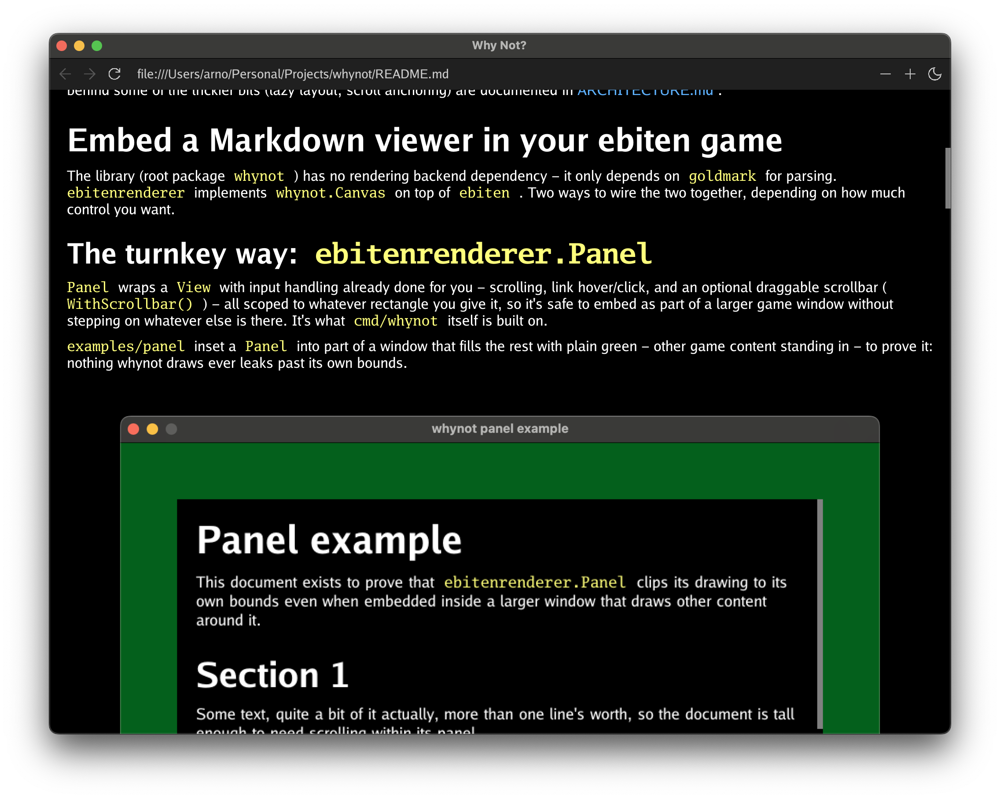

# Why Not?

A Markdown document viewer for [ebiten](https://ebitengine.org/) games,
written in Go - for anything that needs to show real formatted text (patch
notes, an in-game journal, help screens, a credits scroll) without pulling
in a full UI toolkit. Point it at a `[]byte` of Markdown and it lays out
and draws the document straight onto an `ebiten.Image`, using
[goldmark](https://github.com/yuin/goldmark) to parse.

- **Broad Markdown coverage** - tables, nested lists, images (including
  animated GIFs), links, blockquotes, code blocks, and more - degrading
  gracefully instead of crashing on anything not yet supported
- **Built for long documents** - layout and drawing are lazy, anchored at
  the current scroll position, so a resize or scroll costs the same
  whether the document is 10 lines or 10,000
- **Fully customizable styling** - colors, margins, and text styles all
  resolve through one `StyleSheet` interface (dark and light themes built
  in), swappable at runtime
- **Drop-in embedding** - `ebitenrenderer.Panel` adds a scrollable,
  zoomable Markdown view to part of a larger game window in a few lines,
  with resizing, hover/click, and an optional scrollbar all handled for
  you

## Try the standalone viewer

`cmd/whynot` is a small standalone app built entirely on the library - the
easiest way to see what whynot can do.

On macOS or Linux:

```bash
brew install arnodel/tap/whynot
```

Otherwise, grab a binary for your platform from the
[latest release](https://github.com/arnodel/whynot/releases/latest), or build
it yourself:

```bash
go install github.com/arnodel/whynot/cmd/whynot@latest
```

Run it with no argument and it opens a built-in welcome page explaining how
to use it. Here is a screenshot of using it to view this README.



## Status

Pre-1.0 - the API may still change. See [Features](#features) below for
what's implemented. Architecture, internal layout model, and the
reasoning behind some of the trickier bits (lazy layout, scroll
anchoring) are documented in [ARCHITECTURE.md](ARCHITECTURE.md).

## Embed a Markdown viewer in your ebiten game

The library (root package `whynot`) has no rendering backend dependency -
it only depends on `goldmark` for parsing. `ebitenrenderer` implements
`whynot.Canvas` on top of `ebiten`. Two ways to wire the two together,
depending on how much control you want.

### The turnkey way: `ebitenrenderer.Panel`

`Panel` wraps a `View` with input handling already done for you -
scrolling, link hover/click, and an optional draggable scrollbar
(`WithScrollbar()`) - all scoped to whatever rectangle you give it, so
it's safe to embed as part of a larger game window without stepping on
whatever else is there. It's what `cmd/whynot` itself is built on.

[`examples/panel`](examples/panel) inset a `Panel` into part of a window
that fills the rest with plain green - other game content standing in -
to prove it: nothing whynot draws ever leaks past its own bounds.


```go
package main

import (
	"fmt"
	"image"
	"image/color"
	"log"
	"strings"

	"github.com/hajimehoshi/ebiten/v2"

	"github.com/arnodel/whynot"
	"github.com/arnodel/whynot/ebitenrenderer"
)

const (
	windowWidth  = 800
	windowHeight = 600
	panelMargin  = 60 // inset on all sides, so the background shows around the panel
)

var backgroundColor = color.RGBA{0x20, 0x60, 0x20, 0xFF} // green, to make it distinct from the panel contents

func exampleDoc() string {
	var b strings.Builder
	b.WriteString("# Panel example\n\n")
	b.WriteString("This document exists to prove that `ebitenrenderer.Panel` clips its drawing to\n")
	b.WriteString("its own bounds even when embedded inside a larger window that draws other\n")
	b.WriteString("content around it.\n\n")
	for i := 1; i <= 8; i++ {
		fmt.Fprintf(&b, "## Section %d\n\n", i)
		b.WriteString("Some text, quite a bit of it actually, more than one line's worth, so the\n")
		b.WriteString("document is tall enough to need scrolling within its panel.\n\n")
	}
	return b.String()
}

func main() {
	view := whynot.NewView([]byte(exampleDoc()), whynot.NewGoFontFaceSelector(72), whynot.WithStyleSheet(whynot.NewDarkStyleSheet()))
	bounds := image.Rect(panelMargin, panelMargin, windowWidth-panelMargin, windowHeight-panelMargin)
	panel := ebitenrenderer.NewPanel(view, ebitenrenderer.New(), bounds, ebitenrenderer.WithScrollbar())

	ebiten.SetWindowSize(windowWidth, windowHeight)
	ebiten.SetWindowTitle("whynot panel example")
	if err := ebiten.RunGame(&game{panel: panel}); err != nil {
		log.Fatal(err)
	}
}

type game struct {
	panel *ebitenrenderer.Panel
}

func (g *game) Update() error {
	g.panel.Update()
	return nil
}

func (g *game) Draw(screen *ebiten.Image) {
	screen.Fill(backgroundColor)
	g.panel.Draw(screen)
}

func (g *game) Layout(outsideWidth, outsideHeight int) (int, int) {
	return windowWidth, windowHeight
}
```

Run it yourself: `go run ./examples/panel`.

### Finer control: `whynot.View` directly

Drop to `View` (plus `ebitenrenderer.Canvas`) yourself for full control
over input handling, or to fit whynot into an `Update`/`Draw` structure
that doesn't match what `Panel` assumes - the same building blocks
`Panel` itself is built on:


```go
package main

import (
	"fmt"
	"log"
	"strings"
	"time"

	"github.com/hajimehoshi/ebiten/v2"

	"github.com/arnodel/whynot"
	"github.com/arnodel/whynot/ebitenrenderer"
)

func exampleDoc() string {
	var b strings.Builder
	b.WriteString("# View example\n\n")
	b.WriteString("This document is rendered by wiring `whynot.View` up directly - full control\n")
	b.WriteString("over input handling, at the cost of doing it yourself (see `ebitenrenderer.Panel`\n")
	b.WriteString("for the turnkey alternative).\n\n")
	for i := 1; i <= 8; i++ {
		fmt.Fprintf(&b, "## Section %d\n\n", i)
		b.WriteString("Some text, quite a bit of it actually, more than one line's worth, so the\n")
		b.WriteString("document is tall enough to need scrolling.\n\n")
	}
	return b.String()
}

type game struct {
	view     *whynot.View
	renderer *ebitenrenderer.Renderer
	start    time.Time
}

func (g *game) Update() error {
	_, dy := ebiten.Wheel()
	g.view.Scroll(dy * 2)
	return nil
}

func (g *game) Draw(screen *ebiten.Image) {
	// View.Draw fills its own background (from the View's StyleSheet) -
	// no separate clear step needed here.
	g.view.Draw(g.renderer.NewCanvas(screen), 0, 0)
}

func (g *game) Layout(outsideWidth, outsideHeight int) (int, int) {
	// The last argument is elapsed time since rendering started - only
	// animated images actually need it (see whynot.RenderingContext.Time).
	g.view.Layout(outsideWidth, outsideHeight, 1, time.Since(g.start))
	return outsideWidth, outsideHeight
}

func main() {
	g := &game{
		view:     whynot.NewView([]byte(exampleDoc()), whynot.NewGoFontFaceSelector(72)),
		renderer: ebitenrenderer.New(),
		start:    time.Now(),
	}
	ebiten.SetWindowSize(800, 600)
	ebiten.SetWindowTitle("whynot view example")
	if err := ebiten.RunGame(g); err != nil {
		log.Fatal(err)
	}
}
```

Run it yourself: `go run ./examples/view`.

[`cmd/whynot`](cmd/whynot) is a fuller example built the `Panel` way (see
above), handling display scale, zoom, and a toolbar too.

## Styling

Appearance - colors, margins, text sizes/weights, and a handful of dimensional
constants (table/blockquote geometry, rule and strikethrough thickness) - is entirely
driven by the `StyleSheet` interface ([stylesheet.go](stylesheet.go)), resolved per node
when the layout tree is built rather than hardcoded anywhere. `DefaultStyleSheet` is the
configurable built-in implementation; `NewDarkStyleSheet()`/`NewLightStyleSheet()` (what
`cmd/whynot`'s theme toggle switches between) are both just different field values on the
same struct - tweak one (`s := whynot.NewDarkStyleSheet(); s.LinkColor = myColor`) and
pass it via `whynot.WithStyleSheet(s)`, or embed `DefaultStyleSheet` in your own type and
override individual methods for full control over one aspect (e.g. per-node margins)
without reimplementing the rest. Swapping a `View`'s `StyleSheet` at runtime
(`View.SetStyleSheet`) re-lays-out the document immediately, which is all `cmd/whynot`'s
theme toggle button does.

## `cmd/whynot`: a standalone viewer

```
go run ./cmd/whynot path/to/some.md
```

Run with no argument and it opens a built-in welcome page (embedded in the
binary, `cmd/whynot/assets/welcome.md`) explaining how to use it - including
pasting a file path or `http(s)` URL (Cmd/Ctrl+V) to open it, and pasting
the word "welcome" to come back. Beyond scrolling and resizing, it
demonstrates what a caller can build on top of the library:

- **`-light`** switches to the light theme at startup; the toolbar button
  toggles between light and dark while running.
- **Dragging the scrollbar** jumps to a position (`View.ScrollToRatio`) -
  it self-corrects toward wherever the mouse currently is as
  not-yet-resolved parts of the document get resolved during the drag,
  rather than drifting away from the cursor. **↓**/**↑** nudge the scroll
  position a bit at a time, repeating while held.
- **Hovering a link** highlights it (`View.Hover`).
- **Clicking a link follows it** - a relative path loads another local
  file, an `http(s)` URL fetches it (opening it in the system's default
  browser instead if its `Content-Type` turns out to be HTML rather than
  Markdown/plain text - a real webpage, not a `.md` file), and a URL
  fragment (`#some-heading`) scrolls to that heading
  (`View.ScrollToAnchor`), even on a document just navigated to. Either
  way it's resolved against the current document's own location
  (`net/url.URL.ResolveReference`), so a relative link works the same
  whether that document came from disk or from a fetch.
- **Backspace goes back** to wherever a link was followed from, exact
  scroll position included - whether that was a different document or
  just an in-page anchor jump.
- **Images resolve and load the same way** - a relative `src` is
  resolved against the document's own location, an `http(s)` one is
  fetched, regardless of whether the document itself came from disk or
  a fetch. Fetching and decoding happen in the background, never
  blocking rendering; a missing or undecodable image falls back to its
  alt text (or title, or a generic message) instead of a silent gap.
- **`-debug-hit`** outlines whatever `View.HitTest` resolves under the
  cursor, for debugging.
- **`-debug-stats`** (togglable at runtime with **F**) shows FPS/TPS and
  per-frame Update/Draw timing.
- A Markdown construct whynot doesn't understand (e.g. raw HTML) shows in
  a distinct color with a warning logged, instead of crashing the whole
  document - see [Features](#features).

None of the link-following/history logic lives in the library itself -
`whynot` only exposes the primitives (`View.Hover`, `LinkAt`,
`ScrollToAnchor`, `ScrollPosition`/`RestoreScrollPosition`); loading
files, fetching URLs, and keeping a history stack are all `cmd/whynot`'s
own (`load.go`, `navigate.go`). Image loading follows
the same split, one layer further in: the library defines `ImageSource`
(defaulting to a plain local file open) and owns caching the result
(`ImageCache` - an image is resolved, fetched, and decoded at most once,
however many times it's asked for, however many rendering backends ask
for it); `cmd/whynot` supplies the file-or-`http(s)`,
resolved-against-the-document's-location `ImageSource`, via
`WithImageSource`.

## Features

Checked items are implemented; unchecked ones aren't yet. Grouped by theme rather than
by implementation order now that most of the list is done.

**Text and inline formatting**
- [x] Headings (all 6 levels), paragraphs
- [x] Emphasis, strong, and both together (`*x*`, `**x**`, `***x***`)
- [x] Strikethrough (`~~x~~`)
- [x] Inline code
- [ ] Typographer (smart quotes/dashes) - blocked on a real gap in the inline model:
      goldmark emits the substitution as a separate Text node with no whitespace from
      its neighbor (e.g. `Alice's` -> `"Alice"`, `"'"`, `"s "` as three siblings), but
      `appendString` word-splits each sibling independently, so adjacent no-space
      siblings would render as separately-spaced words - needs word-adjacency tracking
      across sibling Inlines first

**Block structures**
- [x] Fenced and indented code blocks
- [x] Blockquotes, including nested ones
- [x] Thematic breaks (`---`)
- [x] Ordered and unordered lists, tight or loose, nested to any depth, including task
      lists (`- [ ]`)
- [x] Tables (GFM), including column alignment and negotiated column widths - needed a
      genuine 2D layout primitive (`TableBox`, row height = max of that row's cells),
      not an extension of the existing 1D `StackBox`/`ContainerBox`
- [ ] Footnotes, definition lists - goldmark extensions for both exist but aren't
      enabled, so the syntax (`[^1]`, term/`: definition`) isn't recognized at all yet,
      rendering as plain literal text

**Images**
- [x] PNG/JPEG/GIF, including animated GIFs (disposal-correct compositing, always
      looping) - resolved and loaded via a pluggable `ImageSource`, fetched and decoded
      at most once per image regardless of how many times it's asked for; alt text is
      captured from arbitrary inline content, per CommonMark
- [x] Loading never blocks rendering - a still-pending image shows a placeholder at its
      final size once known (or a "loading" fallback before that); a missing or
      undecodable image falls back to alt text, then title, then a generic message
- [ ] Prefetch images ahead of the scroll position - today an image only starts loading
      once its containing slot is actually resolved (in practice, scrolled near), not
      when the document is first opened

**Links and navigation**
- [x] Links and autolinks, including reference-style (`[text][ref]`) - highlighted on
      hover (`View.Hover`), destination resolvable at a point (`View.LinkAt`)
- [x] Heading anchors: goldmark's auto-generated heading ids, scrollable to via
      `View.ScrollToAnchor` - what a link's `#fragment` targets
- [ ] Raw inline/block HTML rendered as HTML - currently shown as flagged unsupported
      text instead, not a crash, but not styled/laid out as real HTML would be either

**Rendering and performance**
- [x] Scrolling, window resizing with reflow and scroll-position anchoring, and
      viewport culling - all handled by `whynot.View`
- [x] `View.DocumentBounds`/`VisibleViewBounds` expose real per-slot pixel-height
      geometry (each top-level slot's height, once resolved; extrapolated from the
      average of what's known for the rest, refined as more of the document is visited)
      for a caller to build its own scrollbar, or feed to any other UI it wants to drive
      from scroll position. `View.ScrollToRatio` is the other direction - a caller
      driving a scrollbar thumb drag recomputes the ratio from the mouse's current
      position every frame rather than a target captured once, so a jump into
      not-yet-resolved territory only ever corrects toward the cursor, never drifts
- [x] Large documents: layout and drawing are lazy, built outward from the current
      scroll position rather than the whole document, so cost tracks what's on screen,
      not the document's total size - a resize deep into a ~1000-line document costs
      microseconds, not tens of milliseconds. See
      [ARCHITECTURE.md](ARCHITECTURE.md#view-tying-the-layers-together-with-the-right-lifecycle)
      for how
- [x] Graceful degradation: a Markdown construct whynot doesn't recognize (e.g. raw
      HTML) logs a warning and renders as flagged, distinctly colored text/code showing
      its source, rather than crashing - a reference-style link's own `[ref]: url`
      definition line and an HTML comment are recognized as intentionally invisible
      rather than unsupported, since no Markdown renderer ever shows them either

**Embedding**
- [x] `ebitenrenderer.Panel` embeds a scrollable document into part of a larger
      `ebiten.Game`'s own window - coordinate translation, hover/click, wheel
      scroll gated on its own bounds, and an optional draggable scrollbar
      (`WithScrollbar`), all bounds-aware so a panel never affects anything
      outside its own rectangle. See [above](#embed-a-markdown-viewer-in-your-ebiten-game)

**Styling**
- [x] Fully customizable via the `StyleSheet` interface (see [above](#styling)) -
      colors, margins, text styles/sizes, and dimensional constants all resolve through
      it; override one field on `DefaultStyleSheet`, or embed it in a custom
      `StyleSheet` for full control. Swappable at runtime (`View.SetStyleSheet`) -
      `cmd/whynot`'s light/dark toggle is just two `DefaultStyleSheet` instances

**`cmd/whynot`, the standalone viewer**
- [x] Built-in welcome page, shown by default, explaining how to use the app
- [x] Paste a file path or `http(s)` URL to open it; paste "welcome" to return here
- [x] A link to a webpage opens in the system browser instead of failing; a link to
      Markdown opens in whynot itself (see [above](#cmdwhynot-a-standalone-viewer))
- [x] Back/forward history, light/dark theme, zoom
- [x] Scrollbar - via `ebitenrenderer.Panel`'s `WithScrollbar()` (not the library itself:
      `View.DocumentBounds`/`VisibleViewBounds` expose the geometry an embedder needs to
      build its own, whether that's `Panel`'s version, a native scrollbar widget, or
      something else entirely). Draggable (`View.ScrollToRatio`), with hover/drag color
      feedback and a theme-aware color (a light thumb on the dark theme's near-black
      background would be invisible against the light theme's white one, and vice versa)
- [ ] A real app icon instead of the generic terminal one when launched as a bundled
      macOS/Windows/Linux app

## Known issues

See [ARCHITECTURE.md](ARCHITECTURE.md#known-issues).
