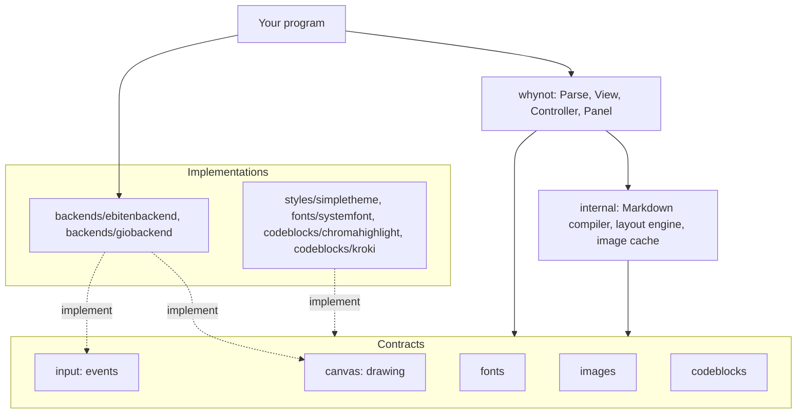

# Why Not?

**whynot** shows Markdown documents in Go games and GUI apps: patch notes, an in-game
journal, help screens, a credits scroll - real formatted text, without pulling in a UI
toolkit. Give it Markdown, and it lays the document out and draws it, scrolled, hovered and
clicked, onto whatever your program draws with. It comes with backends for
[Ebitengine](https://ebitengine.org/) and [Gio](https://gioui.org/), and others can be
added.


- **Broad Markdown coverage:** headings, emphasis, lists, tables, blockquotes, code
  blocks, images (animated GIFs too) and links, degrading gracefully on anything it
  doesn't support rather than failing.
- **Built for long documents:** layout and drawing are lazy, starting from the scroll
  position, so scrolling and resizing cost the same for ten lines as for ten thousand.
- **Drop-in:** a `whynot.Panel` puts a scrollable, clickable document in any rectangle of
  your window, with its own scrollbar, touch scrolling and flings.
- **Styled your way:** colors, text styles, margins and scrollbars come from a stylesheet,
  with light and dark ones ready-made; fonts can be the bundled Go fonts, your own font
  files, or the system's fonts.
- **Extensible code blocks:** syntax highlighting, and diagrams such as Mermaid, through
  code-block plugins.
- **No graphics dependency in the core:** whynot draws through a small `canvas` interface
  and takes input as plain event values, so a backend is a thin adapter.

## Try it

Two standalone viewers are built on the library: the same document browser (links,
history, zoom, themes) on each backend. They're the quickest way to see what whynot does.

| Viewer | Install | In your browser |
|---|---|---|
| [`whynot`](cmd/whynot) (Ebitengine) | `brew install arnodel/tap/whynot`, a [release binary](https://github.com/arnodel/whynot/releases/latest), or `go install github.com/arnodel/whynot/cmd/whynot@latest` | **[Try it](https://arnodel.github.io/whynot/)** |
| [`giowhynot`](backends/giobackend/cmd/giowhynot) (Gio) | `go install github.com/arnodel/whynot/backends/giobackend/cmd/giowhynot@latest` | **[Try it](https://arnodel.github.io/whynot/giowhynot/)** |

Run either with a Markdown file or URL, or with nothing to see its welcome page. The
screenshot above is

```bash
whynot https://raw.githubusercontent.com/arnodel/whynot/refs/heads/main/README.md
```

Each viewer's README covers its keys, options and web version.

## Use it in your program

```bash
go get github.com/arnodel/whynot
```

### Quick start: a document in an Ebitengine game

A `Panel` shows a document in a rectangle of the window and handles its input. Each frame,
the game passes it the input and the time, and gets back what happened, such as a link
being clicked:

```go
package main

import (
	"image"
	"log"
	"time"

	"github.com/hajimehoshi/ebiten/v2"

	"github.com/arnodel/whynot"
	"github.com/arnodel/whynot/backends/ebitenbackend"
	"github.com/arnodel/whynot/fonts"
	"github.com/arnodel/whynot/styles/simpletheme"
)

const source = "# Hello\n\nThis is **whynot**, showing [a link](https://example.com)."

type game struct {
	panel    *whynot.Panel
	renderer *ebitenbackend.Renderer
	input    ebitenbackend.Input
	start    time.Time
}

func (g *game) Update() error {
	for _, e := range g.panel.Frame(g.input.Events(), time.Since(g.start)) {
		if link, ok := e.(whynot.LinkClick); ok {
			log.Println("clicked", link.Destination)
		}
	}
	return nil
}

func (g *game) Draw(screen *ebiten.Image) {
	g.panel.Draw(g.renderer.NewCanvas(screen), time.Since(g.start))
}

// Layout draws at the device's resolution, so text stays sharp.
func (g *game) Layout(outsideWidth, outsideHeight int) (int, int) {
	scale := ebiten.Monitor().DeviceScaleFactor()
	w, h := int(float64(outsideWidth)*scale), int(float64(outsideHeight)*scale)
	g.panel.SetBounds(image.Rect(0, 0, w, h))
	g.panel.SetScale(scale)
	g.input.Scale = scale
	return w, h
}

func main() {
	doc := whynot.Parse([]byte(source))
	view := whynot.NewView(doc, fonts.NewGoSelector(), simpletheme.DarkStyleSheet)
	panel := whynot.NewPanel(view, image.Rectangle{})
	panel.SetScrollbar(true)
	g := &game{panel: panel, renderer: ebitenbackend.New(), start: time.Now()}
	if err := ebiten.RunGame(g); err != nil {
		log.Fatal(err)
	}
}
```

A link within the document (`#heading`) scrolls there by default. Following any other
link is up to you, since only your program knows what it should load.
[`examples/panel`](examples/panel) shows a Panel inset in a larger game window.

### With Gio

```bash
go get github.com/arnodel/whynot/backends/giobackend
```

The same Panel, fed by `giobackend.Input` and drawn through `giobackend.Renderer`. Gio only
draws a frame when something happens, so ask for the next one while `Panel.Animating()`.
The [package documentation](https://pkg.go.dev/github.com/arnodel/whynot/backends/giobackend)
has the frame loop, and [`examples/gio`](backends/giobackend/examples/gio) runs it. The
Gio backend is a separate module, so the rest of whynot doesn't depend on Gio.

### More control: View and Controller

A Panel is a `View`, which draws a document scrolled to a position, plus a `Controller`,
which turns input into scrolling, hovering and clicking. Use them directly to fit whynot
into your own structure:

```go
view := whynot.NewView(doc, fonts.NewGoSelector(), simpletheme.DarkStyleSheet)
controller := whynot.NewController(view)

// Each frame:
view.SetBounds(rect)                 // where it's drawn on the canvas
events := controller.Frame(in, now) // input events in, events out
view.Draw(canvas, now)
```

A View can also be driven on its own, by your code: `ScrollBy`, `ScrollToRatio`,
`ScrollToAnchor`, `VisibleRange` for building your own scrollbar, and `HoveredLink` for
a status bar. [`examples/view`](examples/view) scrolls one with the mouse wheel and
nothing else. Positions throughout are in the canvas's pixels: see
[Coordinates](https://pkg.go.dev/github.com/arnodel/whynot#hdr-Coordinates).

### Styles

Appearance comes from the View's stylesheet. [`styles/simpletheme`](styles/simpletheme)
makes one from plain fields: use a ready-made one, or start from a preset and change what
you need.

```go
theme := simpletheme.Dark() // or Light()
theme.LinkColor = myColor
theme.HeadingTextStyles[0] = simpletheme.TextStyle{Size: 48, Weight: simpletheme.WeightBlack}
view.SetStyleSheet(theme.StyleSheet())
```

A stylesheet can be swapped at any time, which is all a light/dark toggle needs.

### Fonts

The stylesheet decides each piece of text's size, weight and family; a
`fonts.FaceSelector` decides which font draws it.

- `fonts.NewGoSelector()`: the Go fonts, bundled.
- `fonts.NewCustomSelector()`: your own font files or bytes, per family, weight and style,
  falling back to the Go fonts for the rest ([`examples/customfont`](examples/customfont)).
- [`fonts/systemfont`](fonts/systemfont): fonts installed on the machine, by name, or this
  platform's usual UI font ([`examples/systemfont`](examples/systemfont)).

```go
selector := systemfont.New()
selector.RegisterPreferredFont(fonts.Proportional)
selector.RegisterSystemFont(fonts.Monospace, "Menlo")
```

### Code blocks: highlighting and diagrams

Code-block plugins change how fenced blocks in the languages they handle are shown: as
colored tokens, or as an image such as a diagram. They're tried in order, so an image's
source can show, highlighted, until it loads:

```go
doc := whynot.Parse(source,
	whynot.WithCodeBlockPlugin(kroki.Renderer{}),        // Mermaid and other diagrams, via kroki.io
	whynot.WithCodeBlockPlugin(chromahighlight.Plugin{}), // syntax highlighting, via chroma
)
```

[`codeblocks`](codeblocks) defines plugins, so you can write your own;
[`examples/chromahighlight`](examples/chromahighlight) shows highlighting.

### Images

Images load in the background and never hold up drawing. By default an image's source is
a local file path; `whynot.WithImageSource` takes an `images.Source` to resolve sources
your own way, such as against the document's URL.

### Examples

| Example | Shows |
|---|---|
| [`examples/panel`](examples/panel) | a Panel inset in a larger Ebitengine window |
| [`examples/view`](examples/view) | a View driven by hand |
| [`examples/chromahighlight`](examples/chromahighlight) | syntax highlighting |
| [`examples/customfont`](examples/customfont) | your own font files |
| [`examples/systemfont`](examples/systemfont) | the system's fonts |
| [`examples/wasm`](examples/wasm) | whynot in a web page, through WebAssembly |
| [`backends/giobackend/examples/gio`](backends/giobackend/examples/gio) | a Panel in a Gio window |

Run one with `go run ./examples/panel`, for instance. The viewers in
[`cmd/whynot`](cmd/whynot) and [`giowhynot`](backends/giobackend/cmd/giowhynot) are full
programs built the same way.

## How it works


```mermaid
flowchart TB
    app["Your program"]
    whynot["whynot: Parse, View, Controller, Panel"]
    subgraph contracts["Contracts"]
        canvas["canvas: drawing"]
        input["input: events"]
        fonts["fonts"]
        images["images"]
        codeblocks["codeblocks"]
    end
    subgraph impl["Implementations"]
        backends["backends/ebitenbackend, backends/giobackend"]
        others["styles/simpletheme, fonts/systemfont, codeblocks/chromahighlight, codeblocks/kroki"]
    end
    internal["internal: Markdown compiler, layout engine, image cache"]
    app --> whynot
    app --> backends
    whynot --> internal
    whynot --> contracts
    internal --> contracts
    backends -. implement .-> canvas
    backends -. implement .-> input
    others -. implement .-> contracts
```

- **The pipeline:** `Parse` compiles Markdown (with
  [goldmark](https://github.com/yuin/goldmark)) into a tree of blocks. A View lays out
  only the part of it on screen, starting from the scroll position, and draws it onto a
  `canvas.Canvas`. The stylesheet and fonts decide how it looks along the way.
- **The frame loop:** each frame, a backend turns its framework's input into `input`
  events. A Controller turns those into scrolling, hovering and clicking, and returns
  what the app may react to as `whynot.Event` values. The View then draws onto the
  backend's canvas.
- **Contracts in their own packages:** what whynot consumes, such as a canvas, fonts,
  images and code-block plugins, is defined in a small public package, with
  implementations alongside. A new backend, font source or plugin needs nothing else.

[ARCHITECTURE.md](ARCHITECTURE.md) goes into the details: the layout model, lazy layout,
scroll anchoring, hit-testing, image loading.

## Features

**Text**
- [x] Headings, paragraphs, emphasis, strong, strikethrough, inline code
- [x] Typographer: smart quotes, dashes and ellipses

**Blocks**
- [x] Fenced and indented code blocks, scrolling sideways when wider than the view
- [x] Syntax highlighting and diagrams, through code-block plugins
- [x] Blockquotes, nested
- [x] Lists: ordered and unordered, tight or loose, nested to any depth, task lists
- [x] Tables (GFM), with column alignment and negotiated column widths, scrolling
      sideways when wider than the view
- [x] Thematic breaks
- [ ] Footnotes and definition lists: shown as plain text for now
- [ ] Raw HTML: shown as flagged, unstyled source rather than rendered

**Images**
- [x] PNG, JPEG and GIF, animated GIFs included, from a pluggable source
- [x] Loaded in the background and prefetched ahead of the scroll position; a placeholder
      at the final size while loading; the alt text if loading fails

**Links**
- [x] Links and autolinks, reference-style included, highlighted on hover
- [x] Heading anchors: `#heading` links scroll to their heading

**Viewing and interaction**
- [x] Lazy layout and drawing: cost follows what's on screen, not the document's size
- [x] Smooth scrolling, the scroll position kept across resizes and restyles
- [x] Mouse wheel, touch scrolling with flings, keyboard commands (step, page, sideways)
- [x] A built-in scrollbar, styled by the stylesheet, or your own from `VisibleRange`
- [x] Zoom
- [x] Graceful degradation: anything not supported shows as flagged text with a warning,
      never a crash

**Styling**
- [x] Colors, text styles, line height, margins and scrollbars from a stylesheet, swappable
      at runtime; light and dark presets
- [x] The bundled Go fonts, your own font files, or the system's fonts

## Status

whynot follows [semantic versioning](https://semver.org/). From v1.0.0, the API of every
public package in the main module is stable: anything under `internal/`, and the
programs in `cmd/` and `examples/`, aren't part of that promise. The Gio backend is a
separate module that stays on v0 while Gio does, because Gio's types are part of its API.

Known issues are listed in [ARCHITECTURE.md](ARCHITECTURE.md#known-issues), and ideas for
the future are [GitHub issues](https://github.com/arnodel/whynot/issues?q=is%3Aissue+is%3Aopen+label%3Aenhancement).

whynot is released under the [Apache License 2.0](LICENSE).
