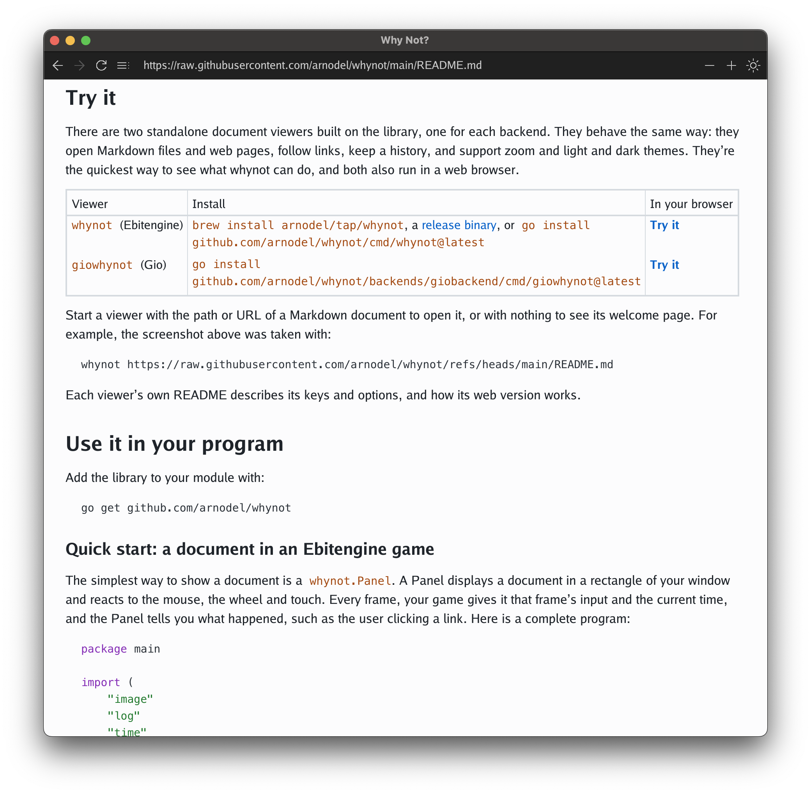
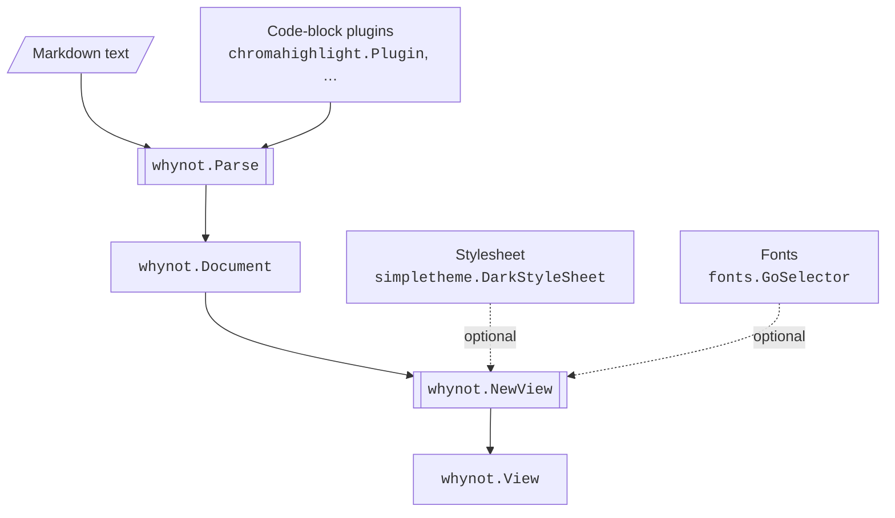
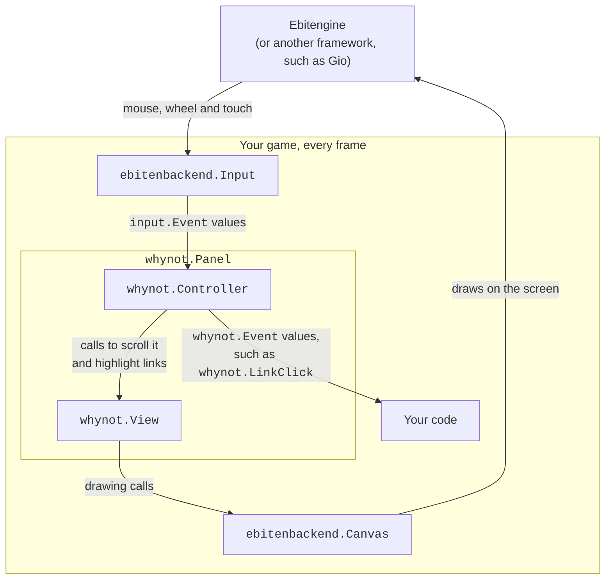

# Why Not?

**whynot** is a Go library for showing Markdown documents inside games and GUI apps. Think
of patch notes, an in-game journal, help screens or a credits scroll: real formatted text,
with headings, lists, tables, images and links, but without bringing in a whole UI
toolkit. You give whynot some Markdown, and it lays the document out, draws it, and lets
the user scroll through it and click its links. It draws through a small interface rather
than a particular graphics library, and it comes with backends for
[Ebitengine](https://ebitengine.org/) and [Gio](https://gioui.org/).



- **Broad Markdown coverage.** Headings, emphasis, lists, tables, blockquotes, code
  blocks, images (including animated GIFs) and links are all supported. Anything whynot
  doesn't support yet is shown as flagged text rather than breaking the document.
- **Built for long documents.** whynot only lays out the part of the document that's on
  screen, so scrolling and resizing are just as fast for ten thousand lines as for ten.
- **Easy to drop in.** A `whynot.Panel` shows a document in any rectangle of your window
  and handles its input, including a scrollbar, touch scrolling and flings.
- **Styled your way.** Colors, text styles, margins and scrollbars come from a stylesheet;
  light and dark ones are ready-made. Text can use the bundled Go fonts, your own font
  files, or the fonts installed on the system.
- **Extensible code blocks.** Plugins can add syntax highlighting to code blocks, or turn
  them into pictures, such as Mermaid diagrams.
- **Independent of any graphics library.** whynot draws through a small `canvas`
  interface and receives input as plain values, so supporting another framework only
  takes a thin adapter.

## Try it

There are two standalone document viewers built on the library, one for each backend.
They behave the same way: they open Markdown files and web pages, follow links, keep a
history, and support zoom and light and dark themes. They're the quickest way to see what
whynot can do, and both also run in a web browser.

| Viewer | Install | In your browser |
|---|---|---|
| [`whynot`](cmd/whynot) (Ebitengine) | `brew install arnodel/tap/whynot`, a [release binary](https://github.com/arnodel/whynot/releases/latest), or `go install github.com/arnodel/whynot/cmd/whynot@latest` | **[Try it](https://arnodel.github.io/whynot/)** |
| [`giowhynot`](backends/giobackend/cmd/giowhynot) (Gio) | `go install github.com/arnodel/whynot/backends/giobackend/cmd/giowhynot@latest` | **[Try it](https://arnodel.github.io/whynot/giowhynot/)** |

Start a viewer with the path or URL of a Markdown document to open it, or with nothing to
see its welcome page. For example, the screenshot above was taken with:

```bash
whynot https://raw.githubusercontent.com/arnodel/whynot/refs/heads/main/README.md
```

Each viewer's own README describes its keys and options, and how its web version works.

## Use it in your program

Add the library to your module with:

```bash
go get github.com/arnodel/whynot
```

### Quick start: a document in an Ebitengine game

The simplest way to show a document is a `whynot.Panel`. A Panel displays a document in a
rectangle of your window and reacts to the mouse, the wheel and touch. Every frame, your
game gives it that frame's input and the current time, and the Panel tells you what
happened, such as the user clicking a link. Here is a complete program:

```go
package main

import (
	"image"
	"log"
	"time"

	"github.com/hajimehoshi/ebiten/v2"

	"github.com/arnodel/whynot"
	"github.com/arnodel/whynot/backends/ebitenbackend"
)

const source = "# Hello\n\nThis is **whynot**, showing [a link](https://example.com)."

type game struct {
	panel    *whynot.Panel
	renderer *ebitenbackend.Renderer // draws onto Ebitengine images
	input    ebitenbackend.Input     // reads Ebitengine's mouse, wheel and touch
	start    time.Time               // the start of the panel's clock
}

func (g *game) Update() error {
	// Pass this tick's input to the panel, which scrolls, highlights links
	// and so on, and returns what the app may want to react to.
	events := g.panel.Frame(g.input.Events(), time.Since(g.start))
	for _, e := range events {
		if link, ok := e.(whynot.LinkClick); ok {
			log.Println("clicked a link to", link.Destination)
		}
	}
	return nil
}

func (g *game) Draw(screen *ebiten.Image) {
	// Draw the panel onto the screen, as it is at this time (animated
	// images and fading scrollbars depend on it).
	g.panel.Draw(g.renderer.NewCanvas(screen), time.Since(g.start))
}

func (g *game) Layout(outsideWidth, outsideHeight int) (int, int) {
	// Draw at the screen's real resolution, so text stays sharp on a
	// high-density display.
	scale := ebiten.Monitor().DeviceScaleFactor()
	w, h := int(float64(outsideWidth)*scale), int(float64(outsideHeight)*scale)
	g.panel.SetBounds(image.Rect(0, 0, w, h)) // fill the window, which may have been resized
	g.panel.SetScale(scale)                   // size text and margins for that resolution
	return w, h
}

func main() {
	doc := whynot.Parse([]byte(source))
	// A View draws a document, by default in the bundled Go fonts and a dark theme.
	view := whynot.NewView(doc)
	// The panel's bounds are set in Layout, once the window size is known.
	panel := whynot.NewPanel(view, image.Rectangle{})
	panel.SetScrollbar(true)
	g := &game{panel: panel, renderer: ebitenbackend.New(), start: time.Now()}
	if err := ebiten.RunGame(g); err != nil {
		log.Fatal(err)
	}
}
```

When the user clicks a link to a heading in the same document (a `#heading` link), the
Panel scrolls there by itself. Any other link is reported to your program as a
`whynot.LinkClick`, and it's up to you what to do with it, because only your program knows
where documents come from. [`examples/panel`](examples/panel) shows a Panel that covers
only part of a game's window.

### With Gio

The Gio backend lives in its own module, so that programs which don't use Gio don't
depend on it. Add it with:

```bash
go get github.com/arnodel/whynot/backends/giobackend
```

A Panel works the same way in a Gio window: `giobackend.Input` provides the input, and
`giobackend.Renderer` provides the canvas to draw on. The one difference is that Gio only
draws a new frame when something happens, so while the Panel is animating (a fling
coasting to a stop, say, or a scrollbar fading out) your program must ask Gio for the next
frame. The [package documentation](https://pkg.go.dev/github.com/arnodel/whynot/backends/giobackend)
shows the whole frame loop, and [`examples/gio`](backends/giobackend/examples/gio) is a
program you can run.

### Another framework

A backend for another framework should provide two things: a `canvas.Canvas` that draws text,
images and rectangles with the framework, and an input reader that turns the framework's
input into whynot's input events. Your program then runs the same frame loop as above.
[backends/README.md](backends/README.md) explains what each part has to do, and the two
existing backends are short enough to serve as examples.

### More control: View and Controller

A Panel is made of two parts, which you can also use directly when you need more control
than a Panel gives you, for example to fit whynot into a structure of your own:

- a **`View`** lays out and draws a document, scrolled to a position;
- a **`Controller`** turns input into what it does to a View: scrolling, highlighting the
  link under the pointer, and reporting clicks.

```go
view := whynot.NewView(doc)
controller := whynot.NewController(view)

// Then, every frame:
view.SetBounds(rect)                 // the rectangle of the screen the view occupies
events := controller.Frame(in, now) // apply this frame's input; get back what happened
view.Draw(canvas, now)               // draw the view within its rectangle
```

Your own code can also move a View directly, without any input: `ScrollBy` scrolls by a
distance, `ScrollToAnchor` jumps to a heading, and `ScrollToRatio` jumps to a point in the
document. To draw a scrollbar of your own, `VisibleRange` tells you which part of the
document is on screen, and `HoveredLink` tells you which link is under the pointer, for a
status bar. [`examples/view`](examples/view) shows a View on its own, scrolled with the
mouse wheel. All positions are measured in the canvas's pixels; the
[Coordinates](https://pkg.go.dev/github.com/arnodel/whynot#hdr-Coordinates) section of
the documentation explains this in detail.

### Styles

A View's appearance comes from its stylesheet. The
[`styles/simpletheme`](styles/simpletheme) package makes stylesheets from a set of plain
fields: you can use one of its ready-made stylesheets, or start from one of its themes and
change what you need, then make a stylesheet from it. A View uses the dark theme unless you
give it another stylesheet, with `whynot.WithStyleSheet` or later with `SetStyleSheet`:

```go
theme := simpletheme.Dark() // or simpletheme.Light()
theme.LinkColor = myColor
theme.HeadingTextStyles[0] = simpletheme.TextStyle{Size: 48, Weight: simpletheme.WeightBlack} // top-level headings
view.SetStyleSheet(theme.StyleSheet())
```

You can change a View's stylesheet at any time, which is all it takes to switch between a
light and a dark theme.

### Fonts

The stylesheet decides the size, weight and family of each piece of text, and a font
selector decides which font actually draws it. whynot comes with three:

- `fonts.NewGoSelector()` uses the Go fonts, which are bundled with whynot. A View uses
  them unless you give it another selector, with `whynot.WithFaceSelector`.
- `fonts.NewCustomSelector()` uses font files you provide, for whichever families, weights
  and styles you choose, and the Go fonts for the rest. See
  [`examples/customfont`](examples/customfont).
- The [`fonts/systemfont`](fonts/systemfont) package uses fonts installed on the computer,
  either by name or by picking the platform's usual interface font. See
  [`examples/systemfont`](examples/systemfont).

```go
selector := systemfont.New()
// The platform's usual interface font. On an error, such as the font not
// being installed, the bundled Go fonts are used instead.
if err := selector.RegisterPreferredFont(fonts.Proportional); err != nil {
	log.Print(err)
}
// A font installed on the system, by name.
if err := selector.RegisterSystemFont(fonts.Monospace, "Menlo"); err != nil {
	log.Print(err)
}
view := whynot.NewView(doc, whynot.WithFaceSelector(selector))
```

### Code blocks: highlighting and diagrams

By default, a code block is shown as plain text in a single color. Code-block plugins
change that for the languages they handle: a plugin can split the code into colored
tokens, for syntax highlighting, or replace the block with an image, such as a rendered
diagram. Plugins are passed to `Parse`, and they're tried in the order given. That order
matters when a plugin produces an image: while the image loads, or if it fails to, the
next plugin's version of the block is shown, such as the diagram's source, highlighted.

```go
doc := whynot.Parse(source,
	whynot.WithCodeBlockPlugin(kroki.Plugin{}),          // draws Mermaid diagrams, using kroki.io
	whynot.WithCodeBlockPlugin(chromahighlight.Plugin{}), // highlights code, using the chroma library
)
```

The [`codeblocks`](codeblocks) package defines what a plugin is, so you can write your
own. [`examples/chromahighlight`](examples/chromahighlight) shows syntax highlighting.

### Images

Images are loaded in the background, so a slow image never holds up scrolling or drawing.
For safety, nothing is fetched unless you allow it: a document parsed without an image
registry shows each image's alternative text instead. A registry from the
[`fetch`](fetch) package says which URL schemes images can come from, and you give it to
`whynot.Parse` with the URL that relative image sources are relative to:

```go
root, err := os.OpenRoot("docs") // local images are only read from beneath this directory
if err != nil {
	log.Fatal(err)
}
registry := fetch.NewRegistry(fetch.FileResolver{Root: root}, fetch.HTTPResolver{})
doc := whynot.Parse(markdown, whynot.WithBaseURL(location), whynot.WithImageRegistry(registry))
```

`fetch.HTTPResolver` fetches `https` images only, unless you set its `AllowHTTP` field.
You can also write a resolver of your own for another URL scheme.

### Examples

Each of these is a small program you can run, for example with `go run ./examples/panel`:

| Example | What it shows |
|---|---|
| [`examples/panel`](examples/panel) | A Panel covering part of an Ebitengine game's window |
| [`examples/view`](examples/view) | A View used on its own, scrolled with the mouse wheel |
| [`examples/chromahighlight`](examples/chromahighlight) | Syntax highlighting in code blocks |
| [`examples/customfont`](examples/customfont) | Text in a font file of your choice |
| [`examples/systemfont`](examples/systemfont) | Text in the fonts installed on the system |
| [`examples/wasm`](examples/wasm) | whynot running in a web page, compiled to WebAssembly |
| [`backends/giobackend/examples/gio`](backends/giobackend/examples/gio) | A Panel in a Gio window |

The two viewers, [`whynot`](cmd/whynot) and [`giowhynot`](backends/giobackend/cmd/giowhynot),
are complete applications built the same way.

## How it works

First, `whynot.Parse` turns the Markdown into a `Document`, with the help of any code-block
plugins, and `whynot.NewView` makes a View to show it. A stylesheet and fonts decide how it
looks; without them, the View uses a dark theme and the bundled Go fonts:


```mermaid
flowchart TB
    md[/"Markdown text"/]
    plugins["Code-block plugins<br/><code>chromahighlight.Plugin</code>, …"]
    parse[["<code>whynot.Parse</code>"]]
    doc["<code>whynot.Document</code>"]
    sheet["Stylesheet<br/><code>simpletheme.DarkStyleSheet</code>"]
    fonts["Fonts<br/><code>fonts.GoSelector</code>"]
    newview[["<code>whynot.NewView</code>"]]
    view["<code>whynot.View</code>"]
    md --> parse
    plugins --> parse
    parse --> doc
    doc --> newview
    sheet -. optional .-> newview
    fonts -. optional .-> newview
    newview --> view
```

Then, every frame, your program runs a loop between its graphics framework and whynot.
Here it is with Ebitengine; with Gio, the same roles are played by `giobackend.Input` and
`giobackend.Canvas`:


```mermaid
flowchart TB
    fw["Ebitengine<br/>(or another framework, such as Gio)"]
    subgraph program["Your game, every frame"]
        input["<code>ebitenbackend.Input</code>"]
        subgraph panel["<code>whynot.Panel</code>"]
            ctrl["<code>whynot.Controller</code>"]
            view["<code>whynot.View</code>"]
        end
        yours["Your code"]
        canvas["<code>ebitenbackend.Canvas</code>"]
    end
    fw -- "mouse, wheel and touch" --> input
    input -- "<code>input.Event</code> values" --> ctrl
    ctrl -- "<code>whynot.Event</code> values,<br/>such as <code>whynot.LinkClick</code>" --> yours
    ctrl -- "calls to scroll it<br/>and highlight links" --> view
    view -- "drawing calls" --> canvas
    canvas -- "draws on the screen" --> fw
```

1. `ebitenbackend.Input` reads what the user did, and turns it into whynot's own input
   events (`input.Event` values).
2. A `whynot.Controller` decides what those events do to the View: scrolling it,
   highlighting the link under the pointer, and so on. It returns anything your program
   may want to react to, such as a click on a link, as `whynot.Event` values.
3. The `whynot.View` lays out the part of the document that's on screen, and draws it.
4. An `ebitenbackend.Canvas` carries out the View's drawing on the screen image.

As the diagram shows, a `whynot.Panel` holds a Controller and a View together, so with a
Panel your program deals with a single object, as in the quick start above. You only need
the Controller and the View separately for finer control. `whynot.Parse` uses
[goldmark](https://github.com/yuin/goldmark) to read the Markdown.

The library is split into packages along these lines:

| Packages | What they're for |
|---|---|
| `whynot` | Parsing, and the View, Controller and Panel |
| `canvas`, `input` | What a backend implements: drawing, and input events |
| `fonts`, `fetch`, `codeblocks` | What a document and a View can be given: fonts, fetching images, code-block plugins |
| `styles/simpletheme` | Stylesheets and their ready-made themes |
| `fonts/systemfont`, `codeblocks/chromahighlight`, `codeblocks/kroki` | Ready-made fonts and plugins |
| `backends/ebitenbackend`, `backends/giobackend` | The two backends |
| `internal/…` | The Markdown compiler, the layout engine and the image cache: not part of the API |

[ARCHITECTURE.md](ARCHITECTURE.md) explains the design in depth: the layout model, how
layout stays lazy, how the scroll position survives a resize, hit-testing, and image
loading.

## Features

**Text**
- [x] Headings, paragraphs, emphasis, strong text, strikethrough and inline code
- [x] Typographic punctuation: smart quotes, dashes and ellipses

**Blocks**
- [x] Fenced and indented code blocks, which scroll sideways when they're wider than the
      view
- [x] Syntax highlighting and diagrams in code blocks, through plugins
- [x] Blockquotes, including nested ones
- [x] Ordered and unordered lists, tight or loose, nested to any depth, and task lists
- [x] Tables (GitHub style), with column alignment and column widths fitted to their
      content, which scroll sideways when they're wider than the view
- [x] Thematic breaks (horizontal rules)
- [ ] Footnotes and definition lists, which are shown as plain text for now
- [ ] Raw HTML, which is shown as flagged source text rather than rendered

**Images**
- [x] PNG, JPEG and GIF images, including animated GIFs
- [x] Background loading, starting ahead of the scroll position, with a placeholder of
      the right size while an image loads, and its alternative text if it can't be loaded

**Links**
- [x] Links, including automatic and reference-style links, highlighted under the pointer
- [x] Links to headings within the document (`#heading`)

**Viewing and interaction**
- [x] Layout and drawing whose cost depends on what's on screen, not on the document's
      length
- [x] Smooth scrolling, with the scroll position kept when the window is resized or the
      style changes
- [x] Scrolling with the mouse wheel, by touch (with flings), or by keyboard commands
      (a step, a page, or sideways)
- [x] A built-in scrollbar styled by the stylesheet, or your own, built with
      `VisibleRange`
- [x] Zoom
- [x] Anything not supported yet is shown as flagged text, with a warning in the log,
      rather than breaking the document

**Styling**
- [x] Colors, text styles, line height, margins and scrollbars set by a stylesheet, which
      can be changed at any time; light and dark themes included
- [x] The bundled Go fonts, your own font files, or the system's fonts

## Status

whynot follows [semantic versioning](https://semver.org/). From version 1.0.0, the API of
every public package in the main module is stable. Packages under `internal/`, and the
programs in `cmd/` and `examples/`, aren't part of that promise. The Gio backend is a
separate module, and it stays at version 0 for as long as Gio does, because Gio's own
types are part of its API.

Known issues are listed in [ARCHITECTURE.md](ARCHITECTURE.md#known-issues). Ideas for the
future are tracked as
[GitHub issues](https://github.com/arnodel/whynot/issues?q=is%3Aissue+is%3Aopen+label%3Aenhancement).

Contributions are welcome: [CONTRIBUTING.md](CONTRIBUTING.md) explains how the project is
worked on.

whynot is released under the [Apache License 2.0](LICENSE).
